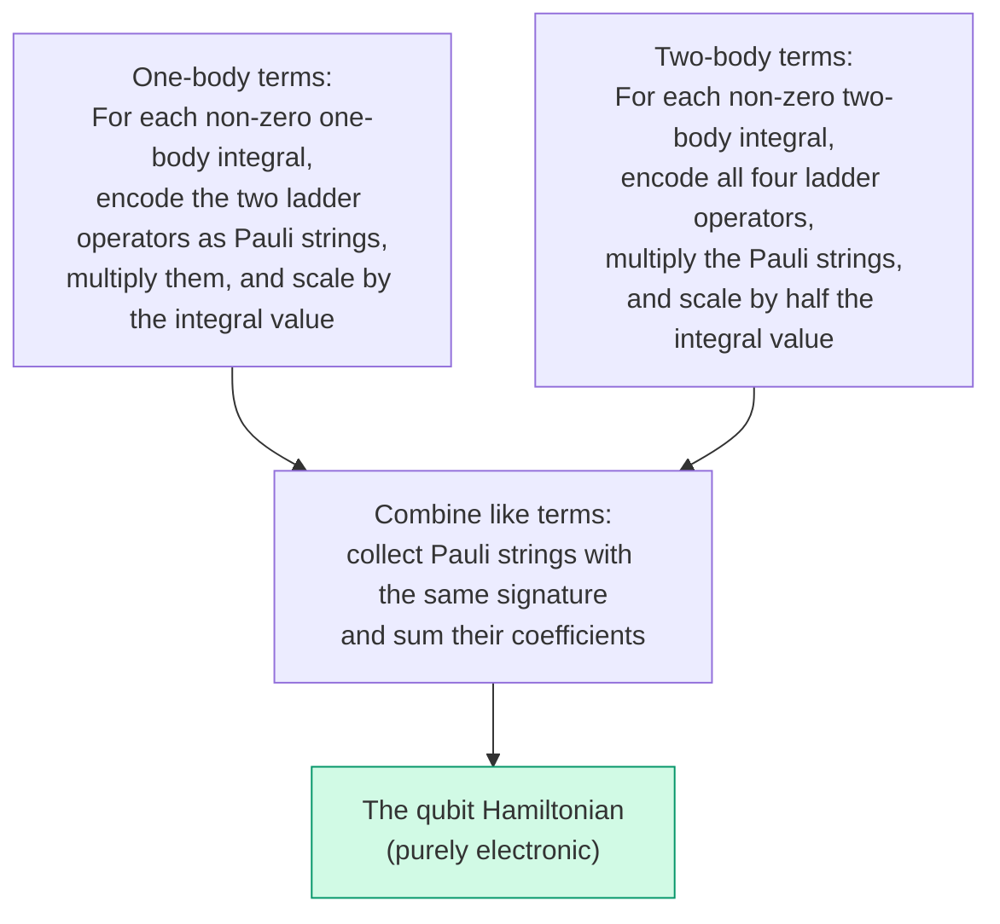

# Chapter 6: Building the Qubit Hamiltonian

_This is where the pipeline pays off. We take the integral tables from Chapter 3, the encoding from Chapter 5, and produce the actual qubit Hamiltonian — the object that a quantum computer will simulate._

## In This Chapter

- **What you'll learn:** How diagonal configuration energies and off-diagonal couplings appear in a qubit Hamiltonian, how to encode fermionic terms into Pauli strings, and how to derive the 15-term H₂ result.
- **Why this matters:** VQE, QPE, and Hamiltonian-simulation algorithms consume this operator. Its coefficients, signs, and Pauli weights determine both the physics and the circuit cost.
- **Prerequisites:** Chapters 1–5 (integrals, notation, spin-orbitals, gates, encoding concepts).

---

## Configuration Energies and Couplings

Before computing Pauli strings, it helps to separate two basis-dependent roles in
the Hamiltonian.

A classical probability distribution over occupation configurations is represented
by a density matrix that is diagonal in that basis:

$$\rho_{\mathrm{mix}}=\sum_i p_i |i\rangle\langle i|.$$

A coherent state can also contain off-diagonal entries,
$\rho_{ij}=c_i c_j^*$, which retain relative phases between configurations.
The energy is

$$
\langle H\rangle=\operatorname{Tr}(\rho H)
=\sum_i \rho_{ii}H_{ii}+\sum_{i\ne j}\rho_{ij}H_{ji}.
$$

The first sum weights **configuration energies**. The second uses
**configuration couplings**. Off-diagonal Hamiltonian elements allow the
variational ground state to mix determinants and can lower the optimized energy.
That does not mean the correlation energy is simply the expectation value of the
off-diagonal terms: after mixing, the diagonal probabilities change too.
Correlation energy is the difference between the optimized correlated and
Hartree–Fock energies of the full Hamiltonian.

A Hamiltonian diagonal in the occupation basis has computational-basis
eigenstates, so coherence cannot lower its minimum eigenvalue. Degeneracy may
also permit coherent ground states, but it gives no energetic advantage over a
basis-state ground state. Off-diagonal terms containing X or Y connect
configurations and are usually more expensive to simulate because their Pauli
rotations require entangling gates.

Encoding changes the Pauli representation of both diagonal and off-diagonal
fermionic operators. The practical question is not which part is "classical" or
"quantum" in an absolute sense, but how accurately and cheaply the chosen
representation implements the full operator.

---

## What We Have and What We'll Do

Chapters 1–4 gave us everything we need:

- **The chemistry** (Chapter 1): H₂ in STO-3G, 4 spin-orbitals, the second-quantized Hamiltonian.
- **The notation** (Chapter 2): physicist's convention, the conversion rule, the traps to avoid.
- **The numbers** (Chapter 3): complete spin-orbital integral tables and a coefficient factory in F#.
- **The quantum computer** (Chapter 4): qubits, gates, CNOT cost, and the $2(w-1)$ formula.
- **The encoding** (Chapter 5): Jordan–Wigner's Z-chain mechanism for translating fermionic operators to Pauli strings.

The procedure is systematic, but every new input still needs an integral-
convention check, a direct matrix reference where feasible, and a validated
encoding implementation.

---

## The Recipe



FockMap does this symbolically — no matrices, no floats in the intermediate algebra. We'll work through one representative term by hand, then show the complete result.

### One-body terms: number operators

The non-zero one-body integrals for H₂ are all diagonal (Chapter 3): $h_{00} = h_{11} = -1.2533097866$ Ha and $h_{22} = h_{33} = -0.4750688488$ Ha. Under Jordan–Wigner, the number operator simplifies — the Z-chains cancel:

$$\hat{n}_j = a_j^\dagger a_j = \frac{1}{2}(I - Z_j)$$

Weight 1, regardless of system size. The one-body Hamiltonian produces five diagonal terms:

| Pauli term | Coefficient (Ha) | Origin |
|:---:|:---:|:---|
| $IIII$ | $-1.7283786354$ | Sum of all orbital energies, halved |
| $ZIII$ | $+0.6266548933$ | $-h_{00}/2$ (energy of $\sigma_g, \alpha$) |
| $IZII$ | $+0.6266548933$ | $-h_{11}/2$ (energy of $\sigma_g, \beta$) |
| $IIZI$ | $+0.2375344244$ | $-h_{22}/2$ (energy of $\sigma_u, \alpha$) |
| $IIIZ$ | $+0.2375344244$ | $-h_{33}/2$ (energy of $\sigma_u, \beta$) |

All I and Z. By itself, this operator cannot mix occupation configurations; its eigenvalues are read directly from computational-basis states.

### Two-body terms: one by hand

After the symmetry-related index permutations are combined, the Coulomb
repulsion between opposite-spin electrons in $\sigma_g$ contributes
$0.6747559268\,a_0^\dagger a_1^\dagger a_1a_0$.

Encode each operator under JW, multiply the four Pauli strings, and simplify. Three observations make the algebra tractable: the Z-chains cancel ($Z_0 \cdot Z_0 = I$), and each raising-lowering pair simplifies via $(X - iY)(X + iY) = 2(I - Z)$.

$$a_0^\dagger a_1^\dagger a_1 a_0 = \frac{1}{4}(IIII - ZIII - IZII + ZZII)$$

Scaled by the integral, this gives four diagonal Pauli contributions.

### The off-diagonal coupling, fully identified

The operator previously used here,
$a_0^\dagger a_2^\dagger a_0a_2$, is diagonal: after
anticommuting the operators into number-operator form, it cannot connect two
configurations. The actual H₂ coupling appears only after the symmetry-related
spin-orbital terms are combined. With

$$g=[01\mid01]=[01\mid10]=0.1812104620\ \text{Ha},$$

their off-diagonal contribution is

$$
\begin{aligned}
H_{\mathrm{couple}}=g(&a_0^\dagger a_1^\dagger a_3a_2
+a_2^\dagger a_3^\dagger a_1a_0\\
&-a_0^\dagger a_3^\dagger a_2a_1
-a_1^\dagger a_2^\dagger a_3a_0).
\end{aligned}
$$

The first line transfers an opposite-spin pair between the bonding and
antibonding orbitals; the second line contains the associated spin-exchange
terms. Expanding all four monomials under Jordan–Wigner and collecting phases
gives

$$
H_{\mathrm{couple}}
=\frac{g}{4}(-XXYY+XYYX+YXXY-YYXX).
$$

Thus every four-body Pauli coefficient has magnitude
$g/4=0.0453026155$ Ha. This calculation is reproduced independently by
`code/ch09-verify-h2.py`, which compares the full Pauli matrix with a direct
fermionic construction.

---

## The Complete 15-Term Hamiltonian

After processing all 32 non-zero two-body integrals and combining like terms:

| # | Pauli String | Coefficient (Ha) | Character |
|:---:|:---:|:---:|:---|
| 1 | $IIII$ | $-0.8121706072$ | Energy offset |
| 2 | $IIIZ$ | $-0.2234315369$ | Diagonal |
| 3 | $IIZI$ | $-0.2234315369$ | Diagonal |
| 4 | $IIZZ$ | $+0.1744128761$ | Diagonal |
| 5 | $IZII$ | $+0.1714128264$ | Diagonal |
| 6 | $IZIZ$ | $+0.1206252348$ | Diagonal |
| 7 | $IZZI$ | $+0.1659278503$ | Diagonal |
| 8 | $XXYY$ | $-0.0453026155$ | **Configuration coupling** |
| 9 | $XYYX$ | $+0.0453026155$ | **Configuration coupling** |
| 10 | $YXXY$ | $+0.0453026155$ | **Configuration coupling** |
| 11 | $YYXX$ | $-0.0453026155$ | **Configuration coupling** |
| 12 | $ZIII$ | $+0.1714128264$ | Diagonal |
| 13 | $ZIIZ$ | $+0.1659278503$ | Diagonal |
| 14 | $ZIZI$ | $+0.1206252348$ | Diagonal |
| 15 | $ZZII$ | $+0.1686889817$ | Diagonal |

---

## Reading the Hamiltonian: What's Hartree–Fock, What's Quantum

Now we read this table through the density matrix lens.

Eleven terms contain only I and Z. Together they assign an energy to each
occupation configuration. Four weight-4 terms couple the closed-shell
determinants $\lvert1100\rangle$ and $\lvert0011\rangle$.

Deleting the four coupling terms makes $\lvert1100\rangle$ the lowest
two-electron determinant, with electronic energy $-1.8318636465$ Ha and total
energy $-1.1167593074$ Ha: the Hartree–Fock result. Restoring the coupling
produces the FCI electronic energy $-1.8523881736$ Ha.

The decomposition makes the earlier warning concrete. In the exact ground
state, changed determinant populations raise the diagonal expectation by about
$0.0200046$ Ha relative to the HF determinant, while the off-diagonal
expectation contributes about $-0.0405291$ Ha. Their sum is the net
correlation energy, $-0.0205245$ Ha (about $-12.88$ kcal/mol). The
correlation energy is therefore enabled by the coupling but does not "live
entirely" in four expectation values.

---

## The FockMap Parity Gate

The companion computes the Hamiltonian from the Chapter 3 factory, filters
zero-coefficient entries, and compares sentinel coefficients with the
independent table before printing anything:

```fsharp
#load "code/ch03-spin-orbitals.fsx"

open System.Numerics
open Encodings
open Encodings.BravyiKitaev
open Encodings.Hamiltonian
open Encodings.JordanWigner
open Encodings.MajoranaEncoding
open Encodings.TreeEncoding

let h2RawPhysicistFactory =
    ``Ch03-spin-orbitals``.h2RawPhysicistFactory

// Build the JW Hamiltonian on 4 qubits
let hamiltonian =
    computeHamiltonian h2RawPhysicistFactory 4u

// Print all terms
for t in hamiltonian.DistributeCoefficient.SummandTerms do
    printfn "%+.4f  %s" t.Coefficient.Real t.Signature
```

Output:

```
-0.8122  IIII
-0.2234  IIIZ
-0.2234  IIZI
+0.1744  IIZZ
+0.1714  IZII
+0.1206  IZIZ
+0.1659  IZZI
-0.0453  XXYY
+0.0453  XYYX
+0.0453  YXXY
-0.0453  YYXX
+0.1714  ZIII
+0.1659  ZIIZ
+0.1206  ZIZI
+0.1687  ZZII
```

This is the required output. `code/ch06-building-hamiltonian.fsx` fails with a
convention-mismatch error unless the live package reproduces both the identity
and coupling coefficients; equal term counts are not enough.

The audited source implementation returns exactly **15 assembled terms**; the
companion also applies a $10^{-12}$ reporting threshold defensively. The
coefficient 1-norm
$\lambda_{\mathrm{coeff}}=\sum_k|c_k|=2.6992778241$ Ha includes the identity
term; it is not the commutator quantity used in Chapter 15.

### Trying a different encoding

Only after the JW matrix passes the independent reference should another
encoding be substituted:

```fsharp
let h2_bk =
    computeHamiltonianWith
        bravyiKitaevTerms h2RawPhysicistFactory 4u
let h2_tt =
    computeHamiltonianWith
        ternaryTreeTerms h2RawPhysicistFactory 4u
let h2_par =
    computeHamiltonianWith
        parityTerms h2RawPhysicistFactory 4u
```

All four produce different Pauli strings but the **same eigenvalues**. We'll verify this in Chapter 9.

---

## Key Takeaways

- A diagonal density matrix represents a classical mixture in the chosen basis; off-diagonal entries retain coherence between configurations.
- Off-diagonal Hamiltonian terms couple configurations, but correlation energy is the change in the optimized expectation of the full Hamiltonian.
- The direct H₂ JW Hamiltonian has 11 diagonal terms and 4 configuration-coupling terms.
- The encoding determines how many qubits each off-diagonal term touches — and therefore the circuit cost of quantum simulation.

## Common Mistakes

1. **Remember to add $V_{nn}$ when computing total energy.** The 15-term Hamiltonian above is the purely electronic Hamiltonian. Its eigenvalues are electronic energies $E_\text{el}$. To get the total molecular energy, add the nuclear repulsion: $E_\text{total} = E_\text{el} + V_{nn}$. (For H₂, $V_{nn} = 0.7151$ Ha.)

2. **Wrong operator ordering.** The annihilation operators in $a_p^\dagger a_q^\dagger a_s a_r$ are in *reverse* order. Writing $a_r a_s$ instead of $a_s a_r$ flips signs on coupling terms.

3. **Not combining like terms.** The 32 two-body integrals produce many duplicate Pauli signatures that must be summed.

## Exercises

1. **Number operator by hand.** Verify that $a_2^\dagger a_2 = \frac{1}{2}(I - Z_2)$ by expanding the JW-encoded operators.

2. **Coupling-term sign.** Starting from the four-monomial expression above, explain why $XXYY$ has coefficient $-0.0453026155$ and $XYYX$ has $+0.0453026155$.

3. **Diagonal-only energy.** Delete terms 12–15. What is the ground-state energy of the remaining diagonal Hamiltonian? This diagonal-only ground state corresponds to the Hartree–Fock energy. Add $V_{nn}$ to get the total HF energy and compare with your result from Exercise 2 of Chapter 9.

4. **Encoding comparison.** Run the code with all six encodings. Record the nonzero term counts and explain why equal spectra would not imply equal strings or validate a shared input.

## Further Reading

- Whitfield, J. D., Biamonte, J., and Aspuru-Guzik, A. "Simulation of electronic structure Hamiltonians using quantum computers." *Mol. Phys.* 109, 735 (2011).
- McArdle, S. et al. "Quantum computational chemistry." *Rev. Mod. Phys.* 92, 015003 (2020). Section III.

---

**Previous:** [Chapter 5 — A Visual Guide to Encodings](05-visual-encodings.html)

**Next:** [Chapter 7 — Six Encodings, One Interface](07-six-encodings.html)
