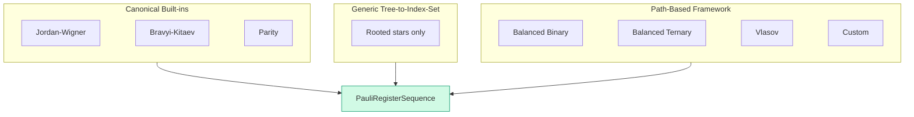

# Chapter 7: Six Encodings, One Interface

_We built the H₂ Hamiltonian with Jordan–Wigner. Its parity chains grow linearly. Can a different representation reduce weight while preserving the operator and labelled states?_

## In This Chapter

- **What you'll learn:** Why we need alternatives to Jordan–Wigner, whether different encodings give the same answer (they do — and we'll see why), and how to compare their costs.
- **Why this matters:** Encoding changes Pauli weight and downstream circuits,
  but only a CAR, matrix, state-order, and spectrum test establishes a faithful
  representation.
- **Prerequisites:** Chapters 1–6 (you have the 15-term JW Hamiltonian and understand the diagonal/off-diagonal structure).

---

## Why Would We Want a Different Encoding?

In Chapter 6, four of the 15 JW terms couple configurations: XXYY, XYYX,
YXXY, and YYXX. They enable determinant mixing; the final correlation energy
comes from the optimized expectation of the full Hamiltonian. Under the
standard staircase these weight-4 rotations also carry the largest H₂ CNOT
cost.

Under Jordan–Wigner, the worst-case ladder-operator weight grows linearly with
the number of modes. Under the standard staircase, a weight-$n$ Pauli
rotation uses $2(n-1)$ logical CNOTs before routing or cancellation. This is a
worst-case operator statement, not a molecule-level gate estimate.

This is the motivation for alternative encodings: **can we preserve the
fermionic operator with shorter Pauli strings?**

Chapter 5 showed that Bravyi–Kitaev and ternary-tree encodings both achieve $\Theta(\log n)$ weight, with different constants and mode assignments. But a natural question arises: if the Pauli strings are different, how do we know we're still computing the same molecule?

The answer is that all valid encodings preserve the **canonical anti-commutation relations** (CAR): $\{a_p^\dagger, a_q\} = \delta_{pq}$. Any encoding that faithfully maps the CAR from fermionic operators to Pauli operators must produce a Hamiltonian with the same spectrum — because the eigenvalues of the Hamiltonian depend only on the algebraic relations among the operators, not on the specific matrix form. Different encodings are related by a unitary change of basis on the qubit Hilbert space, and unitary transformations preserve eigenvalues. This is the mathematical guarantee that the physics is encoding-independent.

---

## Do Different Encodings Give the Same Answer?

Build the H₂ Hamiltonian with each encoding and compare every result with the
independent fermionic matrix from Chapter 9:

```fsharp
#load "code/ch03-spin-orbitals.fsx"
let rawPhysicistFactory =
    ``Ch03-spin-orbitals``.h2RawPhysicistFactory

for (name, encoder) in encoders do
    let ham =
        computeHamiltonianWith encoder rawPhysicistFactory 4u
    let terms = ham.DistributeCoefficient.SummandTerms
    printfn "%-25s  %d terms" name terms.Length
```

For the canonical 0.74 Å input, the direct Jordan–Wigner derivation has 15 terms
and identity coefficient $-0.8121706072$ Ha. Every package encoding must
reproduce the same full spectrum, particle-number structure, and matrix
invariants. Term count and individual strings are representation-level outputs,
so print and test them rather than assuming they match.

This is an important lesson: **for small molecules, encoding choice barely matters.** The differences emerge at scale. But the equivalence — the fact that they all give the same answer — holds at every scale. Let's understand why.

---

## Why Equivalence Holds: The CAR Theorem

An encoding maps fermionic operators $a_p^\dagger$, $a_p$ to qubit operators (Pauli strings). Different encodings produce different Pauli strings for the same ladder operator. But the second-quantized Hamiltonian

$$\hat{H} = \sum_{pq} h_{pq}\, a_p^\dagger a_q + \frac{1}{2}\sum_{pqrs} \langle pq \mid rs\rangle\, a_p^\dagger a_q^\dagger a_s a_r$$

is defined in terms of the *algebra* of the operators — their products and commutation relations — not their specific matrix representations.

The key property that any valid encoding must preserve is the **canonical anti-commutation relations (CAR)**:

$$\{a_p^\dagger, a_q\} = \delta_{pq}, \qquad \{a_p^\dagger, a_q^\dagger\} = 0, \qquad \{a_p, a_q\} = 0$$

Here is the theorem:

> **If an encoding preserves the CAR, then the encoded Hamiltonian has the same eigenvalues as the original fermionic Hamiltonian.**

Why? Because the Hamiltonian is a polynomial in the operators $a_p^\dagger$ and $a_p$. If two representations of these operators satisfy the same algebraic relations (the CAR), then any polynomial in them produces the same algebraic object — and therefore the same eigenvalues. This is a standard result in operator algebra: the CAR define the algebra up to unitary equivalence.

In practice, this means the encoding is a **unitary change of basis** on the qubit Hilbert space. The eigenvalues of a matrix are invariant under unitary conjugation — the spectrum is preserved exactly.

FockMap's test suite verifies the CAR at the Pauli string level for every encoding: it checks that

$$(\text{encoded } a_i^\dagger)(\text{encoded } a_j) + (\text{encoded } a_j)(\text{encoded } a_i^\dagger) = \delta_{ij} \cdot I$$

for all pairs $(i, j)$, using symbolic Pauli multiplication. A passing CAR check
establishes the ladder algebra for the tested modes. Chapter 9 additionally
compares the encoded matrix, labelled basis states, and spectral moments with an
independent fermionic reference; CAR alone does not protect integral processing,
coefficient assembly, ordering, or like-term combination.

This is not just a theoretical nicety. It is what makes encoding choice a **free optimization**: you can pick the encoding that minimizes circuit cost, knowing — with mathematical certainty, not just empirical evidence — that the physics is preserved.

---

## Six Encodings in Six Lines

With equivalence established, let's see all six. Chapter 5 introduced three encoding concepts — JW, BK, and ternary trees. FockMap ships six concrete implementations, because the path-based tree framework (which we'll see shortly) makes it trivial to define new tree shapes:

```fsharp
let encoders = [
    ("Jordan-Wigner",         jordanWignerTerms)
    ("Bravyi-Kitaev",         bravyiKitaevTerms)
    ("Parity",                parityTerms)
    ("Balanced Binary Tree",  balancedBinaryTreeTerms)
    ("Balanced Ternary Tree", ternaryTreeTerms)
    ("Vlasov Tree",           vlasovTreeTerms)
]
```

All six have the same function signature. All six produce `PauliRegisterSequence`. Swapping one for another is a one-word change. The first five will be familiar from Chapter 5; the sixth — the Vlasov tree — is a second ternary tree encoding that we'll introduce in the frameworks section below.

---

## Where the Differences Emerge: Scaling

The differences show up in Pauli weight at larger system sizes:

| $n$ | JW | BK | Ternary Tree | JW/TT ratio |
|:---:|:---:|:---:|:---:|:---:|
| 4 | 4 | 3 | 2 | 2.0× |
| 8 | 8 | 4 | 3 | 2.7× |
| 16 | 16 | 5 | 4 | 4.0× |
| 32 | 32 | 6 | 5 | 6.4× |
| 64 | 64 | 7 | 6 | 10.7× |

At 32 spin-orbitals, JW's worst-case operator touches 32 qubits. The ternary tree touches 5. Since each Pauli rotation costs $2(w-1)$ CNOT gates (Chapter 4), this is the difference between 62 CNOTs and 8 CNOTs *per term* — compounded across every term and every Trotter step.

Recall from Chapter 6 that the off-diagonal terms are the expensive ones. The encoding determines how many qubits those off-diagonal terms touch — and therefore the circuit depth required to create and maintain the coherences that capture the correlation energy.

---

## The Three Frameworks

FockMap implements encodings through two complementary frameworks (plus one special case):



**Canonical built-ins:** JW, BK, and Parity are separate tested
implementations. Their correctness is not inferred by feeding a chain or
Fenwick tree into the generic tree-to-index-set constructor.

**Generic tree-to-index-set construction** (`treeEncodingScheme`): exhaustive
tests for $n=3,\ldots,6$ accept exactly the rooted stars. Chain,
balanced-binary, and Fenwick inputs fail CAR under this construction.

**Path-based framework** (TreeEncoding.fs): An encoding is derived from a
validated labelled rooted tree. This supports tree constructions that are not
expressed by FockMap's current index-set helpers.

**Fenwick-specific BK** (`BravyiKitaev.fs`): this is the separate canonical BK
implementation, with formulas in terms of $j+1$. It is not an output of
`treeEncodingScheme`.

> **Design note:** Seeley, Richard, and Love (2012) describe update, parity, and
> flip/occupation sets for established mappings such as Jordan–Wigner,
> Bravyi–Kitaev, and parity. FockMap's current custom index-set constructor has
> a narrower audited result: an exhaustive census of all $n^{n-1}$ rooted
> labelled trees for $n=3,\ldots,6$ found exactly $n$ CAR-preserving trees
> at each size, all of them stars. This star-only condition applies to that
> tree-derived constructor. It does **not** say that the separately derived
> standard BK index sets are invalid. Use the path-based framework for custom
> trees and verify the CAR in every case.

### Two ternary trees: why tree shape matters

The path-based framework's generality has a concrete payoff: FockMap ships *two* ternary-tree encodings with logarithmic worst-case weight but different tree shapes — the balanced ternary tree associated with Jiang et al. (2020) and a breadth-first tree inspired by Vlasov (arXiv:1904.09912). Both preserve the CAR in the tested implementation, but they assign qubits to tree nodes differently.

How does one go from a tree shape to a working encoding? That's the subject of the next chapter, where we'll build the Vlasov tree step by step — define the tree, plug it into the framework, and verify that it works.

---

## Defining Custom Encodings

FockMap supports two routes for custom encodings beyond the six built-in options:

**Index-set route.** Define three set-valued functions — Update, Parity,
Occupation — and pass them as an `EncodingScheme`. Treat this as a custom
algebraic candidate requiring direct CAR tests. If those sets are generated
from a rooted tree by `treeEncodingScheme`, the verified implementation
contract is star-only.

**Tree-based route.** Define a supported labelled tree and plug it into the
path-based framework. This is the subject of the next chapter, where we build a
breadth-first ternary tree and test its encoded operators.

> **Warning:** Not every custom scheme produces a valid encoding. Always verify the CAR before trusting results — Chapter 8 shows how.

---

## A Decision Framework

| Situation | Recommended encoding | Reasoning |
|:---|:---|:---|
| Learning / prototyping | Jordan–Wigner | Simplest to understand and debug |
| Small system ($n \leq 16$) | Jordan–Wigner | Weight overhead is manageable |
| 1D chain / local interactions | Jordan–Wigner | Adjacent-orbital terms have short Z-chains |
| General-purpose ($n \leq 100$) | Bravyi–Kitaev | Well-studied $\Theta(\log n)$ weight |
| Lower tree-depth constant | Ternary Tree or Vlasov Tree | $\Theta(\log n)$ weight with ternary branching |
| Exploring custom topologies | Path-based | Labelled trees with at most three children; CAR validation required |
| Comparing ternary tree variants | Vlasov Tree | Same scaling, different qubit assignment |
| Comparing multiple encodings | All six | FockMap's interchangeable interface makes this trivial |

---

## Key Takeaways

- JW's $O(n)$ Pauli weight motivates the search for alternative encodings.
- All valid encodings produce Hamiltonians with the **same eigenvalues** — this follows from CAR preservation, not just empirical observation.
- For H₂ (4 qubits), valid encodings preserve the spectrum but generally produce different Pauli strings.
- The scaling advantage of tree-based encodings becomes dramatic above ~16 spin-orbitals.
- Defining a custom encoding is 3–5 lines of F# — but verify CAR before trusting it.

## Common Mistakes

1. **Assuming different strings are either automatically wrong or automatically
   equivalent.** Verify CAR, matrices, labelled states, and spectra under the
   declared basis map.

2. **Assuming term counts are representation-independent.** Compare the complete simplified outputs. Pauli strings, weights, and cancellation patterns can differ even when spectra agree.

3. **Using a custom encoding without verifying CAR.** An encoding that violates anti-commutation will produce plausible but wrong Hamiltonians. Always test.

## Exercises

1. **Weight table.** Run the scaling comparison for $n = 64$ and $n = 128$. At what point does the ternary tree's maximum weight exceed 10?

2. **CAR verification.** Define a custom encoding and use FockMap's test infrastructure to check whether it satisfies anti-commutation. What happens if it doesn't?

3. **Encoding comparison for H₂O.** Build the H₂O/STO-3G Hamiltonian (12 active spin-orbitals, frozen core) with all six encodings. Compare maximum and average Pauli weight.

## Further Reading

- Seeley, J. T., Richard, M. J., and Love, P. J. "The Bravyi–Kitaev transformation for quantum computation of electronic structure." *J. Chem. Phys.* 137, 224109 (2012). The index-set framework.
- Jiang, Z., Kalev, A., Mruczkiewicz, W., and Neven, H. "Optimal fermion-to-qubit mapping via ternary trees with applications to reduced quantum states learning." *Quantum* 4, 276 (2020). DOI: 10.22331/q-2020-06-04-276.
- Vlasov, A. Yu. "Clifford algebras, Spin groups and qubit trees." *Quanta* 11, 97–114 (2022). DOI: 10.12743/quanta.v11i1.199; arXiv:1904.09912.
- Tranter, A. et al. "The Bravyi–Kitaev transformation: Properties and applications." *Int. J. Quantum Chem.* 115, 1431 (2015). Practical JW vs BK comparison.

---

**Previous:** [Chapter 6 — Building the Qubit Hamiltonian](06-building-hamiltonian.html)

**Next:** [Chapter 8 — Building a Tree Encoding](08-building-vlasov.html)
