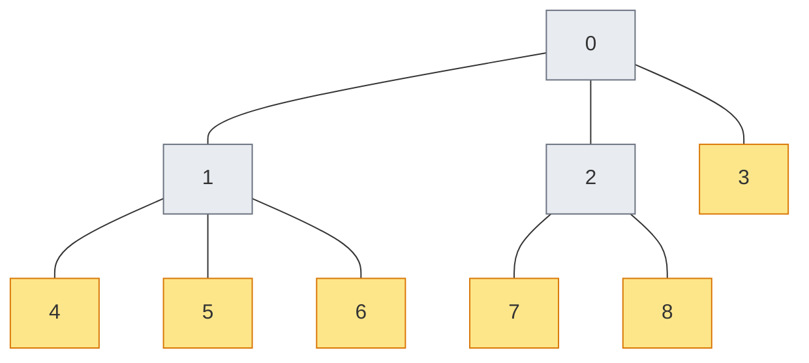
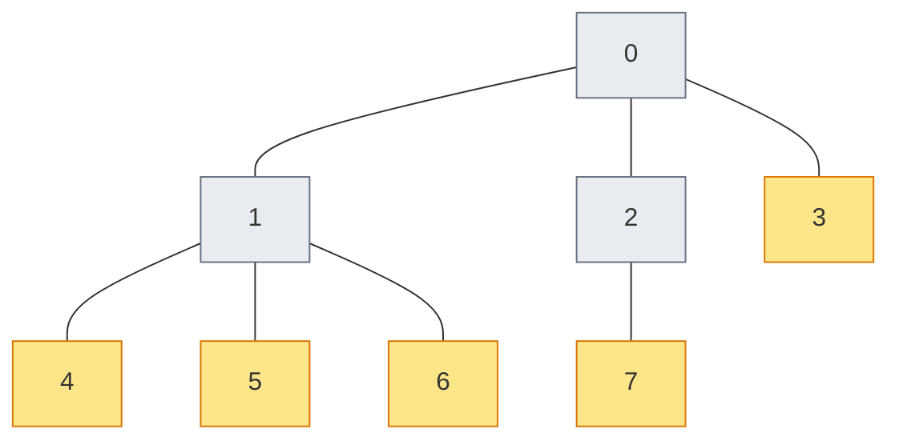
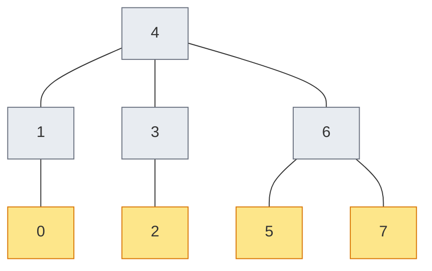

# Chapter 8: Building a Tree Encoding

_Chapter 7 gave us six encodings. This chapter shows how we got the sixth — by building it from scratch._

## In This Chapter

- **What you'll learn:** How the path-based tree framework turns a tree shape into a valid fermion-to-qubit encoding, how to define the Vlasov tree in a few lines of code, and how to verify that a new encoding preserves the canonical anti-commutation relations (CAR).
- **Why this matters:** Understanding the framework well enough to build your own encoding means you're not limited to the built-in options. And the verification skills you'll develop here — checking CAR, comparing eigenvalues — are the same skills you'll need for every pipeline you build.
- **Prerequisites:** Chapter 7 (you know the six encodings, the two frameworks, and the CAR theorem).

> **Scope note:** This chapter covers the tree-based (path-based) route to custom encodings. Chapter 7 briefly introduced the index-set route, which works for star-shaped trees. The tree-based route is strictly more general.

---

## The Goal

In Chapter 7, we listed six encodings and noted that FockMap ships *two* ternary tree encodings: the balanced ternary tree (Jiang et al., 2020) and the Vlasov tree (Vlasov, arXiv:1904.09912). Both achieve $O(\log_3 n)$ worst-case Pauli weight, but they assign qubits to tree nodes differently.

How did the Vlasov tree get into FockMap? Someone had to define the tree shape, plug it into the path-based framework, and verify that the result was a valid encoding. In this chapter, we'll walk through exactly that process — and by the end, you'll be able to do the same for any tree shape you can imagine.

> I am grateful to Dr Robin Kothari and Dr Stephen Jordan for bringing Vlasov's construction to my attention. Their suggestion led directly to the implementation we'll develop here.

---

## Step 1: Define the Tree Shape

The Vlasov tree is a **complete ternary tree** with **breadth-first (level-order) indexing**. Node 0 is the root. The children of node $j$ are $3j+1$, $3j+2$, and $3j+3$ — the same formula used to index a heap in computer science.

For $n = 9$ modes:



Node 0 has children 1, 2, 3. Node 1 has children 4, 5, 6. Node 2 has children 7, 8. Node 3 is a leaf — its would-be children (9, 10, 11) all fall outside $n = 9$.

Compare this with the balanced ternary tree, which uses a recursive midpoint partition: for 9 modes, it puts modes 0–2 in the left subtree, modes 3–5 in the middle, and modes 6–8 on the right. The tree has the same branching factor but a completely different assignment of mode indices to tree positions.

### The code

In FockMap, a tree is built from `TreeNode` records:

```fsharp
let rec buildNode j parent =
    let childIndices =
        [3*j+1; 3*j+2; 3*j+3] |> List.filter (fun c -> c < n)
    let children =
        childIndices |> List.map (fun c -> buildNode c (Some j))
    mkNode j children parent

let tree = mkTree (buildNode 0 None) n
```

Three lines of logic — the rest is plumbing. The key is the child formula: `3*j+1`, `3*j+2`, `3*j+3`. Everything else follows from this.

---

## Step 2: Plug It Into the Framework

The path-based framework takes an `EncodingTree` and produces Pauli strings. Internally, it traces the path from the root to each leaf, collecting Pauli labels (X, Y, Z) on each edge. The tree shape determines the paths; the paths determine the Pauli strings; the Pauli strings determine the encoding.

FockMap wraps this in a one-line convenience function:

```fsharp
let vlasovTreeTerms (op : LadderOperatorUnit) (j : uint32) (n : uint32) =
    let tree = vlasovTree (int n)
    encodeWithTernaryTree tree op j n
```

That's the complete encoding — define the tree, call the generic encoder. The `encodeWithTernaryTree` function handles edge labelling, path traversal, Majorana construction, and phase tracking. You provide only the shape.

---

## Step 3: Compare the Tree Shapes

Before we verify correctness, let's see what the two ternary trees actually look like for $n = 8$:

```fsharp
let vlTree = vlasovTree 8
let btTree = balancedTernaryTree 8
```

**Vlasov tree** ($n = 8$, level-order):



**Balanced ternary tree** ($n = 8$, midpoint-split, root = mode 4):



Different roots, different parent–child relationships, different path lengths for some modes. Yet both produce valid encodings with the same asymptotic weight.

### What do the Pauli strings look like?

Encode the creation operator $a_3^\dagger$ on 8 modes with both trees:

```fsharp
let btTerms = ternaryTreeTerms Raise 3u 8u
let vlTerms = vlasovTreeTerms Raise 3u 8u
```

The Pauli strings are *different* — different signatures, different coefficients. But both satisfy the CAR, and both produce Hamiltonians with the same eigenvalues.

---

## Step 4: Verify Correctness

There are two levels of verification, and you should do both.

### Level 1: Check the CAR

A valid encoding must satisfy the canonical anti-commutation relations:

$$\{a_i^\dagger, a_j\} = \delta_{ij} \cdot I, \qquad \{a_i^\dagger, a_j^\dagger\} = 0, \qquad \{a_i, a_j\} = 0$$

FockMap's test infrastructure checks these symbolically — multiplying encoded Pauli strings and verifying the algebra. If the CAR check passes, the encoding is algebraically valid: the encoded Hamiltonian is guaranteed to have the correct spectrum.

```fsharp
// For each pair (i, j), verify anti-commutation
for i in 0u .. n-1u do
    for j in 0u .. n-1u do
        let ai_dag = vlasovTreeTerms Raise i n
        let aj     = vlasovTreeTerms Lower j n
        // Compute {a†_i, a_j} and check = delta_ij * I
```

This is what FockMap's property tests do for all six encodings at every system size from 1 to 32.

### Level 2: Compare eigenvalues

Build the H₂ Hamiltonian with the new encoding and compare eigenvalues against a known-good encoding:

```fsharp
let vlHam = computeHamiltonianWith vlasovTreeTerms factory 4u
let jwHam = computeHamiltonianWith jordanWignerTerms factory 4u
// Diagonalize both → eigenvalues must match to machine precision
```

The CAR check tells you the algebra is right. The eigenvalue comparison tells you the full pipeline — tree construction, path traversal, Majorana assembly, Hamiltonian construction — is correct end-to-end.

---

## The Weight Comparison

Now that we trust the encoding, let's see how it compares:

| Mode | JW | BK | Balanced Ternary | Vlasov |
|:---:|:---:|:---:|:---:|:---:|
| 0 | 1 | 1 | 3 | 3 |
| 1 | 2 | 2 | 3 | 3 |
| 2 | 3 | 2 | 3 | 3 |
| 3 | 4 | 3 | 3 | 3 |
| 4 | 5 | 3 | 3 | 3 |
| 5 | 6 | 3 | 3 | 3 |
| 6 | 7 | 3 | 3 | 3 |
| 7 | 8 | 4 | 4 | 3 |

For $n = 8$, both ternary trees have maximum weight 3–4, while JW reaches 8 and BK reaches 4. The ternary trees are consistently better for the high-index modes where JW's Z-chains are longest.

The two ternary trees have *slightly* different per-mode weights — because different tree shapes put different modes at different depths — but the same worst-case scaling. This is the point: the $O(\log_3 n)$ guarantee comes from the ternary branching factor, not from the specific assignment of modes to nodes.

---

## The Recipe for Any Tree

You've now seen the complete process. Here it is as a recipe:

1. **Choose a tree shape.** Any rooted tree with at most 3 children per internal node works. The branching factor determines the Pauli weight scaling.

2. **Implement the tree.** Use `mkNode` and `mkTree` to build the `EncodingTree`. The only creative part is the child-assignment rule.

3. **Call `encodeWithTernaryTree`.** The framework handles edge labelling, path traversal, and Majorana construction.

4. **Verify CAR.** Run the anti-commutation check for all pairs $(i, j)$ at several system sizes. If it fails, your tree construction has a bug.

5. **Compare eigenvalues.** Build a Hamiltonian and compare against a known encoding. If eigenvalues match to machine precision, the full pipeline is correct.

The entire Vlasov encoding — from Vlasov's paper to a verified FockMap function — took 6 lines of tree construction, 3 lines of wrapper, and a test suite that matches the property tests used for every other encoding.

---

## Key Takeaways

- The path-based framework turns **any tree shape** into a valid encoding. You provide the shape; the framework provides the algebra.
- The Vlasov tree uses level-order indexing ($3j+1$, $3j+2$, $3j+3$) — a different qubit assignment than the balanced ternary tree, but the same asymptotic weight.
- **Verification is non-negotiable.** A tree that looks reasonable can still violate the CAR. Always check anti-commutation before trusting results.
- Two verification levels: symbolic CAR check (algebraic guarantee) and eigenvalue comparison (end-to-end pipeline check).
- Building a new encoding is **fast** — a few lines of tree construction, plus the validation effort. The path-based framework removes all the hard algebra.

## Exercises

1. **A lopsided ternary tree.** Build a ternary tree for $n = 9$ where each node has exactly one child — node 0's only child is node 1, node 1's only child is node 2, and so on. What is the worst-case Pauli weight? How does it compare to JW? (You've just rediscovered why JW has $O(n)$ scaling — it *is* a depth-$n$ chain tree.)

2. **Asymmetric tree.** Build a ternary tree where the left subtree has depth 2 and the right subtree has depth 4. How does the per-mode weight distribution differ from a balanced tree? Is the worst case better or worse?

3. **Vlasov vs balanced at scale.** Compare the Vlasov and balanced ternary trees at $n = 27$ (a perfect power of 3). Do the per-mode weights differ? What about $n = 30$ (not a perfect power)?

4. **Try the lab.** Run the [Vlasov tree lab](../labs/10-vlasov-tree.html) to see the tree shapes and per-mode weight comparisons in action.

## Further Reading

- Vlasov, A. Yu. "Clifford algebras, Spin groups and qubit trees." *Quanta* 11, 97–114 (2022). arXiv:1904.09912 (2019). The original construction.
- Jiang, Z. et al. "Optimal fermion-to-qubit mapping via ternary trees." *PRX Quantum* 1, 010306 (2020). The balanced ternary tree and path-based framework.

---

**Previous:** [Chapter 7 — Six Encodings, One Interface](07-six-encodings.html)

**Next:** [Chapter 9 — Checking Our Answer](09-verification.html)
