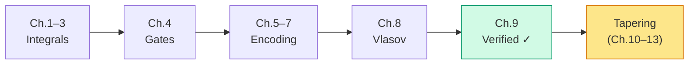

# Chapter 9: Checking Our Answer

_We have fifteen Pauli strings and fifteen coefficients. How do we know they're right? Chapter 8 showed how to verify an encoding algebraically — checking that the CAR hold at the Pauli string level. This chapter adds the second, independent check: compute the eigenvalues and compare with a known reference._

## In This Chapter

- **What you'll learn:** How to verify an encoded Hamiltonian against a direct
  matrix, particle-number sectors, labelled states, and spectral invariants.
- **Why this matters:** Algebraic validation (Chapter 8) guarantees the encoding is correct in isolation. But the full pipeline — integrals, coefficient assembly, like-term combination — has many other places where bugs can hide. Eigenvalue comparison catches them all. If you skip this step, you will eventually publish a wrong number.
- **Prerequisites:** Chapters 1–8 (you have the 15-term Hamiltonian from all six encodings and understand both algebraic and numerical verification).

---

## The Verification Problem

Here is a sobering fact about fermion-to-qubit encoding: **most bugs produce plausible output.**

A wrong-convention Hamiltonian (Chapter 2, Error #1) can have real coefficients and plausible Pauli symmetries. A missing cross-spin block (Chapter 3, Mistake #1) can lose configuration-coupling terms while still looking like a valid Hamiltonian. A reversed operator ordering (Chapter 6, Mistake #2) flips signs but leaves much of the structure intact.

None of these errors will crash your code. All of them will give wrong eigenvalues. The only way to catch them is to compute those eigenvalues and compare with a known reference.

For H₂ in STO-3G, we have an independent direct reference. Cross-encoding
agreement is a useful consistency check, but all implementations can agree on
the same bad tensor or basis permutation.

---

## From Pauli Sum to Matrix

This is the one place where we leave the symbolic world and build a matrix. We do this *only* for verification — the actual quantum simulation never needs a matrix.

Each single-qubit Pauli operator has a $2 \times 2$ matrix:

$$I = \begin{pmatrix}1&0\\0&1\end{pmatrix}, \quad X = \begin{pmatrix}0&1\\1&0\end{pmatrix}, \quad Y = \begin{pmatrix}0&-i\\i&0\end{pmatrix}, \quad Z = \begin{pmatrix}1&0\\0&-1\end{pmatrix}$$

A 4-qubit Pauli string like $IIZZ$ is the tensor product $I \otimes I \otimes Z \otimes Z$ — a $16 \times 16$ matrix. The full Hamiltonian matrix is the weighted sum:

$$H = \sum_{\alpha=1}^{15} c_\alpha \cdot (\text{tensor product of } \sigma_{\alpha,0} \otimes \sigma_{\alpha,1} \otimes \sigma_{\alpha,2} \otimes \sigma_{\alpha,3})$$

For 4 qubits, this is a $16 \times 16$ Hermitian matrix. Diagonalizing it gives 16 eigenvalues.

Dense matrix rows use the occupation integer $b=\sum_jn_j2^j$. Because
FockMap displays signatures as $P_0P_1P_2P_3$, the matrix builder reverses
the displayed signature and forms
$P_3\otimes P_2\otimes P_1\otimes P_0$. The displayed HF ket
$\lvert1100\rangle$ therefore has occupation integer and matrix row 3
(`0b0011`). The verifier applies every number operator to every labelled basis
state; spectrum equality alone cannot detect a basis permutation.

For JW, the reconstructed Pauli matrix equals the direct occupation-basis
matrix element-wise to $2.8\times10^{-16}$ in the repaired source test. The
two-electron ground state's HF determinant amplitude squared is
$0.9873339$. Other encodings may use a different qubit basis: require the
explicit basis transform before comparing their matrix elements with JW, even
when spectra agree.

> **Why 16 and not 6?** The 4-qubit Hilbert space has $2^4 = 16$ basis states, but H₂ has only 2 electrons — so only 6 of those states ($\binom{4}{2} = 6$) have the right particle number. The remaining 10 eigenvalues belong to the 0-electron, 1-electron, 3-electron, and 4-electron sectors. They are physically meaningful (they represent the spectrum with different electron counts) but they are not the ground state we are looking for.

---

## The Eigenspectrum of H₂

Diagonalizing the 15-term JW Hamiltonian gives eigenvalues grouped by particle-number sector:

| Sector ($N_e$) | States | Eigenvalues $E_\text{el}$ (Ha) |
|:---:|:---:|:---|
| 0 | 1 | $0$ |
| 1 | 4 | $-1.2533097866,\; -1.2533097866,\; -0.4750688488,\; -0.4750688488$ |
| **2** | **6** | $\mathbf{-1.8523881736},\; -1.2458776961,\; -1.2458776961,\; -1.2458776961,\; -0.8834567721,\; -0.2319616660$ |
| 3 | 4 | $-1.1607201546,\; -1.1607201546,\; -0.3595836390,\; -0.3595836390$ |
| 4 | 1 | $0.2080748418$ |

The ground state of the physical 2-electron sector is $E_0^\text{el} = -1.8523881736$ Ha. Adding nuclear repulsion:

$$\boxed{E_0^\text{total} = E_0^\text{el} + V_{nn} = -1.8523881736 + 0.7151043391 = -1.1372838345 \text{ Ha}}$$

This is the Full CI ground-state energy for the stated non-relativistic
Hamiltonian, finite STO-3G orbital basis, 0.74 Å geometry, and two-electron
sector. The value comes from the committed PySCF/direct-matrix artifact
(Sun et al., 2020), not from cross-encoding agreement.

---

## How Good Is This?

Let's put the number in context by comparing with simpler approximations:

| Method | $E_\text{total}$ (Ha) | Error (kcal/mol) | What it captures |
|:---|:---:|:---:|:---|
| Hartree–Fock | $-1.1167593074$ | $12.88$ | Mean-field (no correlation) |
| MP2 | $-1.1298973810$ | $4.64$ | Perturbative correlation |
| Full CI (= our result) | $-1.1372838345$ | $0$ | Exact (within basis) |
| Chemical accuracy target | — | $< 1.0$ | The goal for quantum chemistry |

The Hartree–Fock error is $12.88$ kcal/mol for this model. Our Full CI result captures the entire correlation energy within the STO-3G basis. As Chapter 6 showed, configuration coupling makes the lower variational energy possible, but the final correlation energy contains both a change in diagonal populations and an off-diagonal interference contribution.

Of course, STO-3G is a minimal basis — the absolute energy is still far from the true Born–Oppenheimer value. But within the model space we've defined, our answer is exact.

> **The point of quantum simulation is not to replace the basis set.** It offers a different route to the finite-basis electronic problem when explicit Full CI is intractable. For H₂ in STO-3G (6 configurations), any laptop can do Full CI. For 50 electrons in 100 spin-orbitals, explicitly storing roughly $10^{29}$ configuration amplitudes is impossible. A quantum register avoids that storage, but a useful calculation still needs state preparation, adequate target-state overlap, Hamiltonian simulation, and precise measurement. Whether a quantum algorithm wins depends on those costs and on the best classical method for the particular molecule.

---

## Cross-Encoding Verification

After each implementation matches the independent fermionic matrix and state
order, compare all six spectra as an additional consistency check.

```fsharp
for (name, encoder) in encoders do
    let ham =
        computeHamiltonianWith
            encoder h2RawPhysicistFactory 4u
    // ... build 16×16 matrix, diagonalize ...
    printfn "%-25s  E₀ = %.10f Ha" name groundStateEnergy
```

| Encoding | $E_0^\text{el}$ (Ha) | $\lvert\Delta E\rvert$ from JW |
|:---|:---:|:---:|
| Direct fermionic matrix | $-1.8523881736$ | reference |
| Jordan–Wigner Pauli matrix | $-1.8523881736$ | $< 10^{-12}$ |

The direct fermionic and independently derived JW Pauli matrices agree to numerical precision. The pinned FockMap build must reproduce this full spectrum under all six encodings before the six-row package table is restored; agreement among encodings alone cannot validate a shared bad input.

This is not a coincidence. It is a mathematical guarantee: every valid encoding preserves the canonical anti-commutation relations, and therefore preserves the operator algebra, and therefore preserves every eigenvalue. FockMap's test suite verifies the anti-commutation relations symbolically (no eigenvalues needed), but the eigenvalue comparison provides an independent numerical cross-check.

---

## A Verification Checklist

When building and verifying an encoded Hamiltonian, check these in order:

| # | Check | How | What failure means |
|:---:|:---|:---|:---|
| 1 | Term count | Count Pauli strings | Missing/extra integrals |
| 2 | Identity coefficient | Read $IIII$ coefficient | Wrong $V_{nn}$ or integral sum |
| 3 | Diagonal symmetry | All Z-only terms come in pairs ($IIIZ/IIZI$, etc.) | Broken spin symmetry |
| 4 | Coupling terms present | Look for the expected XX/YY strings | Missing cross-spin integrals |
| 5 | Cross-encoding agreement | Build with 2+ encodings, compare spectra | Encoding bug |
| 6 | Known reference | Compare $E_0$ against published value | Convention error |
| 7 | State-resolved order | Check number operators, HF integer/row, and a labelled eigenvector | Basis permutation hidden by equal spectra |

If check 4 fails, the most likely cause is the cross-spin bug from Chapter 3. If check 5 fails, there is a bug in at least one encoding or in the comparison pipeline. A passing check 5 still needs check 6: all encodings can agree on the same bad input.

---

## Encoding Stage Complete

With verification done, we have walked the complete path from molecule to validated qubit Hamiltonian:



The canonical direct matrix and the 15-term JW matrix now agree for H₂/STO-3G at 0.74 Å, with total ground-state energy $-1.1372838345$ Ha. Cross-encoding package parity remains a separate test: every implementation must reproduce this reference before its result is trusted.

But can we make it *smaller*? Can we remove qubits without losing physics? That's what tapering does — and it's where we go next.

---

## Key Takeaways

- Chapter 8 established **algebraic verification** (CAR checks). This chapter adds **numerical verification** (eigenvalue comparison). Both are necessary: algebraic checks validate the encoding; numerical checks validate the full pipeline.
- The H₂/STO-3G ground-state energy at 0.74 Å is $E_0 = -1.1372838345$ Ha (Full CI, exact within basis).
- The direct fermionic matrix and independent JW Pauli matrix agree; all six package encodings must be checked against that external reference.
- Encoding bugs produce structurally plausible but numerically wrong Hamiltonians. Check eigenvalues early and often.
- Matrix diagonalization is used *only* for verification. The actual quantum simulation operates on the symbolic Pauli sum.

## Common Mistakes

1. **Verifying only the ground state.** Check the full spectrum (all particle-number sectors), not just $E_0$. Some bugs preserve the ground state but corrupt excited states.

2. **Comparing absolute energies across basis sets.** STO-3G and cc-pVDZ give different energies for the same molecule. Only compare within the same basis.

3. **Skipping verification for "trusted" code.** Even well-tested libraries can produce wrong results if the integral input is wrong. Verify the first Hamiltonian you build for any new molecule.

## Exercises

1. **Sector analysis.** The 0-electron sector has eigenvalue 0. Why? (Hint: what does the Hamiltonian do to the vacuum state $\lvert 0000\rangle$?)

2. **Correlation energy.** Compute the Hartree–Fock energy of H₂ by hand: $E_\text{HF} = h_{00} + h_{11} + [00\mid00] + V_{nn}$. Verify that $E_\text{corr} = E_\text{FCI} - E_\text{HF} = -0.0205245271$ Ha, about $-12.88$ kcal/mol. Then reproduce Chapter 6's separate diagonal and off-diagonal expectation contributions.

3. **Independent reference.** Run `make verify-data` and inspect the full sector spectrum. Then compare each pinned FockMap encoding against that matrix rather than only against another encoding.

## Further Reading

- Szabo, A. and Ostlund, N. S. *Modern Quantum Chemistry.* §4.1 gives the Full CI eigenvalues for H₂/STO-3G.
- Helgaker, T., Jørgensen, P., and Olsen, J. *Molecular Electronic-Structure Theory.* Chapter 12 covers Full CI theory and implementation.

---

**Previous:** [Chapter 8 — Building a Tree Encoding](08-building-vlasov.html)

**Next:** [Chapter 10 — Why Tapering?](10-why-tapering.html)
