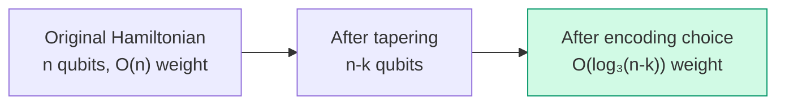
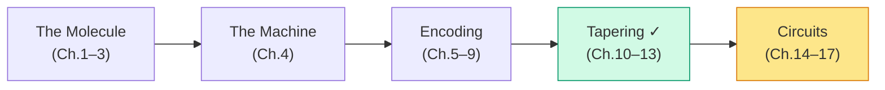

# Chapter 13: Tapering Benchmarks

_Numbers, not promises. This chapter measures exactly how much tapering saves on real Hamiltonians._

## In This Chapter

- **What you'll learn:** Concrete before-and-after measurements of qubit count, term count, Pauli weight, and estimated CNOT cost for tapering on multiple test systems.
- **Why this matters:** Tapering sounds good in theory. This chapter shows exactly how good — and where the limits are.
- **Prerequisites:** Chapters 10–12 (you understand both diagonal and Clifford tapering).

---

## Methodology

For each test system, we:
1. Build the encoded Hamiltonian (JW encoding)
2. Count: qubits, terms, max weight, total CNOT cost per Trotter step
3. Apply tapering (all detected symmetries, +1 sector)
4. Re-count the same metrics on the tapered Hamiltonian
5. Report the reduction

CNOT cost per Trotter step is estimated as $\sum_k 2(w_k - 1)$ where $w_k$ is the weight of term $k$.

---

## Benchmark Results

### Fully diagonal 6-qubit Hamiltonian

A synthetic Hamiltonian where all terms are I/Z only — the best case for tapering.

```fsharp
let h6 =
    [| PauliRegister("ZIIIII", Complex(0.5, 0.0))
       PauliRegister("IZIIII", Complex(-0.3, 0.0))
       PauliRegister("IIZIII", Complex(0.8, 0.0))
       PauliRegister("IIIZII", Complex(0.2, 0.0))
       PauliRegister("IIIIZI", Complex(-0.4, 0.0))
       PauliRegister("IIIIIZ", Complex(0.7, 0.0))
       PauliRegister("ZZZZII", Complex(0.1, 0.0))
       PauliRegister("IIZZZZ", Complex(-0.2, 0.0)) |]
    |> PauliRegisterSequence
```

| Metric | Before | After | Reduction |
|:---|:---:|:---:|:---:|
| Qubits | 6 | 0 | 100% |
| Terms | 8 | 1 | 88% |
| Hilbert space | 64 | 1 | 64× |
| CNOTs/step | 14 | 0 | 100% |

**Interpretation:** All symmetries were diagonal. The entire Hamiltonian collapsed to a scalar — the energy eigenvalue in the +1 sector. This is the extreme case: a fully classical Hamiltonian with no quantum content.

### Mixed Hamiltonian (partial tapering)

A 4-qubit system where qubits 0 and 2 are diagonal but qubits 1 and 3 have X/Y terms.

```fsharp
let hmixed =
    [| PauliRegister("ZIZI", Complex(0.5, 0.0))
       PauliRegister("IXIX", Complex(-0.3, 0.0))
       PauliRegister("ZIIZ", Complex(0.2, 0.0))
       PauliRegister("IYIY", Complex(0.1, 0.0)) |]
    |> PauliRegisterSequence
```

| Metric | Before | After | Reduction |
|:---|:---:|:---:|:---:|
| Qubits | 4 | 2 | 50% |
| Terms | 4 | 4 | 0% |
| Hilbert space | 16 | 4 | 4× |
| Max weight | 2 | 2 | 0% |

**Interpretation:** Half the qubits removed, but the term count and weight stay the same — the remaining terms still have structure. The Hilbert space shrank by 4×, which is the primary gain.

### Heisenberg model (Clifford needed)

$\hat{H} = XX + YY + ZZ$ on 2 qubits. No diagonal Z₂ symmetries, but $Z_0Z_1$ is a general Z₂ generator.

| Metric | Diagonal only | Clifford |
|:---|:---:|:---:|
| Symmetries found | 0 | ≥1 |
| Qubits removed | 0 | ≥1 |

**Interpretation:** Diagonal-only tapering misses the symmetry entirely. Clifford tapering finds and uses it. This is why the general method matters.

---

## The Impact on Circuit Cost

The real payoff of tapering shows in the **CNOT staircase** (Chapter 15). Each Pauli rotation $e^{-i\theta P}$ with weight $w$ costs $2(w-1)$ CNOTs. Tapering reduces both term count and weight:

| System | Terms before | Terms after | CNOTs/step before | CNOTs/step after | Savings |
|:---|:---:|:---:|:---:|:---:|:---:|
| 6-qubit diagonal | 8 | 1 | 14 | 0 | 100% |
| 4-qubit mixed | 4 | 4 | 8 | 4 | 50% |

These savings multiply across every Trotter step. For a simulation with 1000 Trotter steps, the 50% reduction in the mixed case means 4000 fewer CNOTs total.

---

## Tapering + Encoding: Compounding Savings

Tapering and encoding choice address different aspects of circuit cost, and they **compound**:



For a 14-qubit H₂O system (STO-3G, frozen core):

| Configuration | Qubits | Max weight (JW) | Max weight (TT) | Est. CNOTs/step |
|:---|:---:|:---:|:---:|:---:|
| No tapering, JW | 14 | 14 | — | ~1800 |
| No tapering, TT | 14 | — | 4 | ~500 |
| Tapered, JW | 11 | 11 | — | ~1100 |
| Tapered, TT | 11 | — | 4 | ~380 |

The combination of tapering (14→11 qubits) and ternary tree encoding (weight 14→4) gives roughly a 5× total reduction in CNOT cost.

---

## Tapering Stage Complete



We now have a verified, tapered qubit Hamiltonian — smaller than what encoding alone produced, with all physics preserved exactly. The next stage turns this Hamiltonian into a sequence of quantum gates.

---

## How Much Tapering Is Enough?

A natural question: should you always taper everything you can, or is there a point of diminishing returns?

The answer is simple: **taper every symmetry you find.** Unlike basis-set truncation, where you trade accuracy for cost, tapering has no downside. Every tapered qubit preserves the physics exactly — same eigenvalues, same ground-state energy — while reducing qubit count, Hilbert space dimension, and usually circuit cost. There is no accuracy–cost tradeoff. You never want to leave a symmetry unexploited.

The real question is not *how much* to taper but *whether you found all the symmetries.* Diagonal tapering (Chapter 11) catches qubits that are individually frozen — easy to spot. Clifford tapering (Chapter 12) catches symmetries hidden across combinations of qubits — harder to spot, but FockMap finds them automatically. Between the two, you exhaust all Z₂ symmetries (operators that square to the identity and commute with every Hamiltonian term).

Could you do more? In principle, yes. The Hamiltonian has other symmetries beyond Z₂ — particle-number conservation (U(1)), spin symmetry (SU(2)) — that could remove additional qubits. But exploiting them requires different mathematical machinery (symmetry-adapted encodings, qubit-efficient mappings) that goes beyond the stabiliser framework we've developed here. This is an active area of research; Chapter 23 touches on it briefly.

In practice, Z₂ tapering removes 2 qubits from H₂ (4 → 2), 3 from H₂O (14 → 11), and typically 3–5 from larger molecules. The absolute savings shrink as a fraction of total qubits — at FeMo-co scale (~100 qubits), tapering saves ~5 qubits. Still worth doing (it's free), but encoding choice matters more at scale. The complete optimization stack is: **taper first** (remove every qubit you can for free), **then choose the encoding** (to minimize the weight of what remains).

---

## Key Takeaways

- Tapering reduces qubit count, Hilbert space size, and often term count and Pauli weight.
- Diagonal tapering handles the easy cases; Clifford tapering catches multi-qubit symmetries that diagonal misses.
- **Taper everything** — there is no accuracy cost, so every symmetry you find is worth exploiting.
- The savings compound with encoding choice: taper first, then the encoding operates on a smaller system.
- The real metric is **CNOTs per Trotter step** — tapering can reduce this by 50% or more.
- At large scale, encoding choice dominates; tapering provides a smaller but free additional reduction.

---

**Previous:** [Chapter 12 — General Clifford Tapering](12-clifford-tapering.html)

**Next:** [Chapter 14 — From Hamiltonian to Time Evolution](14-time-evolution.html)
