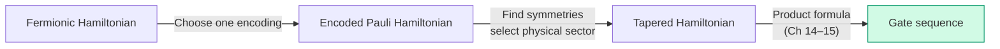

# Chapter 17: Cost Analysis Across Encodings

_Everything we've done — encoding, tapering, Trotterization — converges to one number: the CNOT count. This chapter computes it._

## In This Chapter

- **What you'll learn:** The generated H₂ logical CNOT counts and the evidence
  required before extending the comparison to larger molecules or tapering.
- **Why this matters:** This answers the practical question: "which encoding should I use for my molecule?" The answer depends on the system size, and the numbers tell the story.
- **Prerequisites:** Chapters 14–16 (Trotter decomposition and CNOT staircase).

---

## The Optimization Stack

Before we compute anything, here is the encoding-to-compilation sequence:

Each stage contributes multiplicatively:
- **Tapering** reduces qubit count by $k$, often reduces term count
- **Encoding choice** reduces worst-case weight from $O(n)$ to $O(\log n)$
- **Trotter order** trades rotations per step for error convergence rate

The order matters: **encode → identify symmetries → select the physical sector → taper → Trotterize**. To compare encodings, repeat that sequence from the same fermionic Hamiltonian for each encoding.

---

## The Full Cost Formula

The total CNOT cost for one Trotter step is:

$$C_\text{CNOT} = \sum_{k=1}^{L} 2(w_k - 1)$$

where $L$ is the number of non-identity terms and $w_k$ is the Pauli weight of term $k$. For second-order Trotter, multiply by 2 (each term appears twice).

---

## H₂ Direct JW Reference

The independent 15-term JW oracle has 14 non-identity terms, maximum weight 4,
average weight $32/14\approx2.29$, and 36 standard first-order staircase
CNOTs (72 for the symmetric second-order sequence).

Cross-encoding H₂ Hamiltonian costs are withheld until the fixed FockMap release
reproduces the direct coefficient map, dense matrix, zero pruning, and all six
spectral-moment checks. Ladder-operator weight tables remain a separate,
reproduced encoding-level result.

---

## What a Molecular Benchmark Must Contain

The repository does not yet contain reproducible H₂O, LiH, N₂, or FeMo-co
Hamiltonian artifacts, so their former CNOT tables are withheld. Each benchmark
must commit:

- geometry, basis, active space, electron/spin sector, and orbital order;
- the complete nonzero Pauli list for every encoding;
- tapering generators, target eigenvalues, and sector-spectrum checks;
- product-formula order and the treatment of identity terms; and
- machine-readable weights, rotations, and logical CNOT totals.

Until those inputs exist, only the generated H₂ row above and the
encoding-level ladder-weight census are reproducible.

---

## Key Takeaways

- The independent four-qubit H₂ JW reference uses 36 first-order staircase CNOTs.
- Ladder-operator weights show the expected linear-versus-logarithmic separation, but they do not determine molecule-level totals.
- The complete optimization stack is: **encode → identify the physical symmetry sector → taper → Trotterize**. Repeat it for each candidate encoding before comparing costs.
- CNOT count is one feasibility metric alongside depth, connectivity, state preparation, precision, and measurement cost.
- Measurement cost must be computed from the actual post-transformation coefficients; tapering does not guarantee a smaller coefficient 1-norm.

## Common Mistakes

1. **Trying to re-encode a tapered Pauli Hamiltonian.** Fermion-to-qubit encoding comes first. Tapering is then derived in that specific qubit representation.

2. **Turning ladder maxima into molecular totals.** A larger $n$ reveals
   asymptotic weight separation but still does not supply a molecule's term
   distribution.

3. **Ignoring the error budget.** Per-step CNOT count is only one factor; the
   step count follows the chosen ordering, commutators, total time, and target
   simulation error.

## Exercises

1. **H₂ by hand.** Verify the 36-CNOT figure for H₂ first-order Trotter by summing $2(w_k - 1)$ over all 14 non-identity terms.

2. **Benchmark design.** Write the machine-readable metadata required to compare two encodings without mixing active spaces, sectors, or orbital orders.

3. **Run it.** Use the companion script `code/ch07-six-encodings.fsx` to compute the weight scaling table for $n = 4, 8, 16, 32, 64$. At what $n$ does the ternary tree first beat JW?

## Further Reading

- Tranter et al. "The Bravyi–Kitaev Transformation: Properties and Applications." *International Journal of Quantum Chemistry* 115, 1431–1441 (2015). DOI: 10.1002/qua.24969.
- The cost models in this chapter build directly on the encoding definitions (Chapter 7), tapering benchmarks (Chapter 13), and CNOT staircase decomposition (Chapter 16) developed earlier in this book.

---

**Previous:** [Chapter 16 — The CNOT Staircase](16-cnot-staircase.html)

**Next:** [Chapter 18 — The Question We Can Now Answer](18-complete-pipeline.html)
