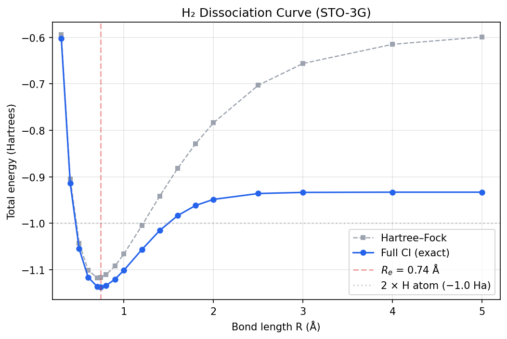

# Chapter 18: The Question We Can Now Answer

_Sixteen chapters of theory and code. Time to run the whole thing._

## In This Chapter

- **What you'll learn:** Every stage of the pipeline assembled into a single executable script — from molecular integrals to quantum circuit — for the hydrogen molecule.
- **Why this matters:** This is the capstone. Every concept from the preceding chapters appears here in its final, integrated form. If you can follow this script line by line and understand what each call does, you have mastered the pipeline.
- **Prerequisites:** All of the preceding stages (Chapters 1–17).

---

## The Payoff

Look back at what we've built.

In Chapter 1, we started with a molecule and asked: *what is its ground-state energy?* That question led us through electronic structure (the integrals), second quantization (the ladder operators), encoding (the Pauli strings), tapering (removing redundant qubits), Trotterization (turning operators into gates), and cost analysis (counting the CNOTs). At each stage we introduced one mathematical transformation, implemented it, and tested it on H₂.

Now we put the whole chain together. The script below takes the H₂ molecular integrals and produces a quantum circuit — ready to run on a simulator or real hardware. Six function calls. Under fifty lines of code. Under a second of runtime.

> **Two executable tracks:** `code/ch18-pipeline.fsx` uses FockMap to construct
> encoded Hamiltonians and logical circuits. `code/ch18-dissociation-scan.py`
> independently uses PySCF HF and FCI to produce the reference energy curve.
> `code/ch09-verify-h2.py` connects the tracks at 0.74 Å by comparing a direct
> fermionic matrix with the derived JW Pauli matrix. The F# companion does not
> infer a ground-state energy from a circuit coefficient.

---

## The Script

```fsharp
#load "code/ch03-spin-orbitals.fsx"

open System.Numerics
open Encodings
open Encodings.BravyiKitaev
open Encodings.CircuitOutput
open Encodings.Hamiltonian
open Encodings.JordanWigner
open Encodings.MajoranaEncoding
open Encodings.TreeEncoding
open Encodings.Trotterization

// ═══════════════════════════════════════════════════════════════
//  The canonical generated integrals (from Chapter 3)
// ═══════════════════════════════════════════════════════════════

let Vnn = 0.7151043391  // Nuclear repulsion energy (Hartrees)
let rawPhysicistFactory =
    ``Ch03-spin-orbitals``.h2RawPhysicistFactory

// ═══════════════════════════════════════════════════════════════
//  All six encodings, one loop
// ═════════════════════════════════════════════════════════════

let encoders = [
    ("Jordan-Wigner",  jordanWignerTerms)
    ("Bravyi-Kitaev",  bravyiKitaevTerms)
    ("Parity",         parityTerms)
    ("Binary Tree",    balancedBinaryTreeTerms)
    ("Ternary Tree",   ternaryTreeTerms)
    ("Vlasov Tree",    vlasovTreeTerms)
]

let pruneZeroTerms (hamiltonian : PauliRegisterSequence) =
    hamiltonian.DistributeCoefficient.SummandTerms
    |> Array.filter (fun term -> Complex.Abs term.Coefficient > 1e-12)
    |> PauliRegisterSequence

for (name, encoder) in encoders do
    // Step 1: Build the qubit Hamiltonian
    let ham =
        computeHamiltonianWith
            encoder rawPhysicistFactory 4u
        |> pruneZeroTerms

    // Step 2: Trotterize the verified untapered Hamiltonian
    let step = firstOrderTrotter 0.1 ham
    let stats = trotterStepStats step

    // Step 3: Export to OpenQASM
    let gates = decomposeTrotterStep step
    let qasm = toOpenQasm defaultOpenQasmOptions 4 gates

    printfn "%-15s  %d qubits  %d terms  %d CNOTs  %d total gates"
        name
        4
        (ham.DistributeCoefficient.SummandTerms.Length)
        stats.CnotCount
        stats.TotalGates
```

That's it. One loop, six encodings, each going from integrals all the way to a quantum circuit.

---

## What Each Line Does

If you've read the preceding chapters, every line should be familiar. But let's trace through one iteration — Jordan–Wigner — to see the full pipeline in action:

**`computeHamiltonianWith encoder rawPhysicistFactory 4u`** — Takes the encoder
and the raw single-bar physicist integrals, applies the documented prefactor and
annihilator order internally, and builds a 4-qubit Pauli Hamiltonian. This is
Chapter 6: the one-body and two-body integrals are paired with encoded ladder
operators and summed into a `PauliRegisterSequence`. For JW, we get the 15-term
Hamiltonian we first met in Chapter 3.

**Why this script does not taper by default** — Tapering is valid only after the
implementation selects a mutually commuting generator set, maps the
two-electron singlet quantum numbers to generator eigenvalues, and passes
untapered-sector versus tapered-spectrum tests. The audited source
implementation places the H₂ ground state in a non-default sector, so an
implicit positive sector would compile the wrong subspace.

**`firstOrderTrotter 0.1 ham`** — Decomposes the verified untapered
Hamiltonian into Pauli rotations (Chapter 14). Each term $c_kP_k$ becomes
$e^{-ic_k\Delta tP_k}$. FockMap's `Rz` convention is
$R_z(\theta)=e^{-i\theta Z/2}$, so the gate parameter is
$\theta=2c_k\Delta t$.

**`decomposeTrotterStep step`** — Converts each Pauli rotation into concrete gates via the CNOT staircase (Chapter 16). A weight-$w$ rotation becomes $2(w-1)$ CNOTs plus single-qubit gates.

**`toOpenQasm defaultOpenQasmOptions numQubits gates`** — Writes the gate sequence as a valid OpenQASM 3.0 program (Chapter 21 will explore this in detail).

**`trotterStepStats step`** — Counts everything: rotations, CNOTs, single-qubit gates, total gates (Chapter 17).

---

## The Acceptance Table

The executable script is intentionally fail-closed. Before it reports any
circuit cost, the live FockMap Hamiltonian must reproduce the independent
15-term JW sentinels from Chapter 6. It reports untapered circuits. Tapered
counts remain a separate evidence gate: each result must name the encoding,
symmetry generators, method, and physical sector and match that untapered
sector's spectrum.

Only then should the script generate a table of qubits, nonzero terms, CNOTs,
and total gates. A six-row table is evidence only when it is generated by the
pinned package and accompanied by those matrix and sector tests.

---

## A Closer Look at the Output

The verified untapered Jordan–Wigner Hamiltonian can be Trotterized and
exported without making a sector assumption:

```fsharp
let jwHam =
    computeHamiltonian
        rawPhysicistFactory 4u
            |> pruneZeroTerms
let jwStep = firstOrderTrotter 0.1 jwHam
let jwGates = decomposeTrotterStep jwStep
let qasm = toOpenQasm defaultOpenQasmOptions 4 jwGates

printfn "%s" qasm
```

The output is a valid QASM 3.0 program — qubit declarations followed by `h`,
`cx`, `rz`, `s`, and `sdg` instructions. On a simulator, verify that its
statevector or unitary matches the intended ordered product of Pauli
exponentials. Time evolution alone does not prepare the ground state or produce
the FCI energy; Chapter 20 separates that circuit primitive from the VQE and QPE
workflows that estimate energy.

---

## Extra Credit: The H₂ Dissociation Curve

The pipeline runs at one geometry — but there's nothing stopping us from running it at *many* geometries. If we vary the bond length $R$ and plot the energy, we get the **dissociation curve**: the potential energy surface of H₂ as the two atoms are pulled apart.

This is a classic test of quantum chemistry methods. Restricted Hartree–Fock
breaks down as the bond stretches because one determinant cannot describe two
separated open-shell atoms. The committed reference curve is computed directly
by PySCF FCI.

### The Skeleton API

At every bond length, the mode count and encoding are fixed while coefficients
and numerical zero patterns can change. FockMap's skeleton API precomputes the
operator expansions, then applies each raw tensor through the explicit
operator-coefficient adapter:

```fsharp
// Precompute the Pauli structure once
let skeleton = computeHamiltonianSkeleton jordanWignerTerms 4u

// Then, for each bond length, plug in the integrals and measure circuit cost
let circuitCostAt (integrals : Map<string, Complex>) =
    let rawFactory key = integrals |> Map.tryFind key
    let ham = applyCoefficients skeleton rawFactory |> pruneZeroTerms
    let step = firstOrderTrotter 0.1 ham
    ham.DistributeCoefficient.SummandTerms.Length,
    (trotterStepStats step).CnotCount
```

`computeHamiltonianSkeleton` performs the encoding algebra once;
`applyCoefficients` then applies each geometry's integrals. The companion writes
these derived term and CNOT counts to ignored
`_build/data/h2_circuit_costs.csv`. Any speedup must be measured for the pinned
implementation rather than assumed to equal the number of geometries.

### The Scan

Regenerate both evidence tracks from the repository root:

```bash
python3 code/ch18-generate-h2-integrals.py
python3 code/ch18-dissociation-scan.py
dotnet fsi code/ch18-pipeline.fsx
make verify-data
```

The integral generator writes `h2_dissociation_integrals.json`; the F# script
reads that file for circuit construction. The PySCF scan separately writes
`h2_dissociation.csv` and the plot. Keeping distinct output paths prevents a
circuit-cost script from overwriting the trusted energy reference.

### The Result

The PySCF output is a table of bond lengths and FCI energies — a slice through
the STO-3G potential energy surface:

| $R$ (Å) | $E_\text{FCI}$ (Ha) | | $R$ (Å) | $E_\text{FCI}$ (Ha) |
|:---:|:---:|:---:|:---:|:---:|
| 0.30 | −0.601804 | | 1.20 | −1.056741 |
| 0.40 | −0.914150 | | 1.40 | −1.015468 |
| 0.50 | −1.055160 | | 1.60 | −0.983473 |
| 0.60 | −1.116286 | | 1.80 | −0.961817 |
| 0.70 | −1.136189 | | 2.00 | −0.948641 |
| **0.74** | **−1.137284** | | 2.50 | −0.936055 |
| 0.80 | −1.134148 | | 3.00 | −0.933632 |
| 0.90 | −1.120560 | | 4.00 | −0.933171 |
| 1.00 | −1.101150 | | 5.00 | −0.933164 |

The energy drops steeply as the atoms approach from infinity, reaches a minimum at **0.74 Å**, then rises sharply as nuclear repulsion takes over at close range. This is the classic Morse-like dissociation curve. At large separations the energy converges to **−0.933 Ha** — two isolated hydrogen atoms, each at −0.4666 Ha in the STO-3G basis.

Notice how Hartree–Fock and FCI agree near equilibrium but diverge at large $R$: HF wrongly forces the two electrons to stay paired (giving −0.599 Ha at $R = 5$ Å, far too high), while FCI correctly dissociates into two independent atoms. This is the **static correlation** problem that motivated quantum simulation in the first place.

The companion script `code/ch18-dissociation-scan.py` generates the data and a publication-quality plot saved to `manuscript/figures/h2_dissociation.png`.



Chapter 19 changes the scanned coordinate from a bond length to an angle, but
its committed energies also come directly from PySCF. FockMap circuit
construction remains a separate track until geometry-by-geometry matrix parity
is demonstrated.

### What the Curve Tells You

The dissociation curve encodes several physical observables:

- **Equilibrium bond length** ($R_e$): the location of the minimum
- **Dissociation energy** ($D_e$): the depth of the well (minimum energy minus the asymptotic value)
- **Vibrational frequency** ($\omega_e$): proportional to the square root of the curvature at the minimum

All three are experimentally measurable, but this coarse grid directly
establishes only the sampled minimum and energy differences. The lowest sampled
point is 0.74 Å, close to the experimental 0.741 Å. A fitted minimum and
curvature would be needed for a precise $R_e$ or vibrational frequency. The
sampled well depth is about $0.204$ Ha (5.6 eV), compared with an experimental
dissociation energy around 4.75 eV; the minimal basis overbinds.

---

## What Generalizes

The data flow generalizes: generate integrals for each geometry, construct the
encoded Hamiltonian, validate it against an independent reference while that is
classically possible, and then compile the operator needed by the chosen
algorithm. Larger molecules also require explicit active spaces, physical
sector selection, state preparation, and resource models; changing only the
integrals and qubit count is not enough.

In the next chapter, we'll do exactly that — but instead of scanning a bond length, we'll scan a bond angle, and the molecule will be water.

---

## Key Takeaways

- FockMap constructs encoded Hamiltonians and logical circuits; PySCF supplies
  the committed HF/FCI dissociation reference.
- The skeleton API separates Pauli structure from geometry-dependent
  coefficients and reports circuit costs without pretending to solve for energy.
- `make verify-data` connects the two tracks at 0.74 Å through an independent
  direct-matrix and sector-spectrum check.
- Larger systems require active-space, sector, state-preparation, algorithm, and
  resource decisions beyond swapping integrals.

## Further Reading

- McArdle, S., Endo, S., Aspuru-Guzik, A., Benjamin, S. C., and Yuan, X. "Quantum computational chemistry." *Rev. Mod. Phys.* 92, 015003 (2020). Comprehensive review of the quantum chemistry simulation pipeline from problem specification to circuit execution.
- Bauer, B., Bravyi, S., Motta, M., and Chan, G. K.-L. "Quantum Algorithms for Quantum Chemistry and Quantum Materials Science." *Chem. Rev.* 120, 12685 (2020). Surveys algorithmic building blocks and resource estimates for end-to-end quantum simulation.

---

**Previous:** [Chapter 17 — Cost Analysis](17-cost-analysis.html)

**Next:** [Chapter 19 — A Fixed-Bond Water Angle Scan](19-bond-angle.html)
