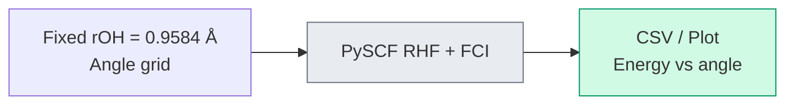
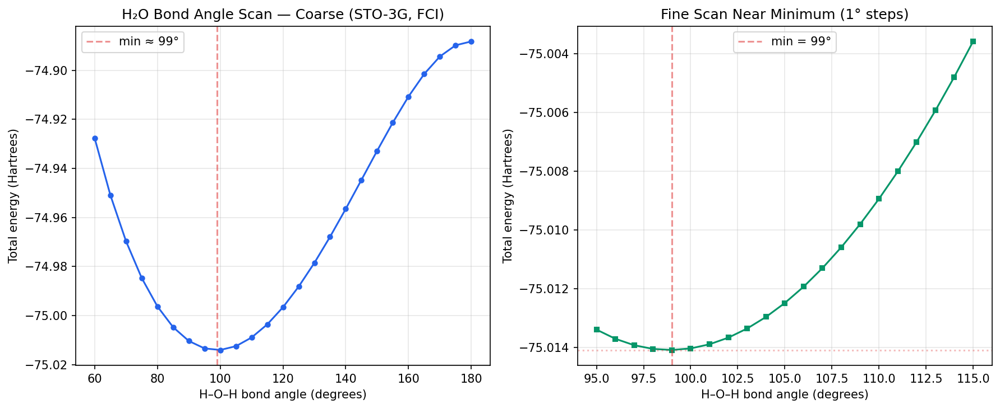

# Chapter 19: A Fixed-Bond Water Angle Scan

_We built the translation layer. Now we examine a classical FCI reference calculation that asks how water's energy changes as the molecule bends._

## In This Chapter

- **What you'll learn:** How to scan one coordinate of a potential energy surface, how to read a conditional minimum, and how to separate a classical chemistry reference from circuit construction.
- **Why this matters:** Geometry scans are the workload that a future quantum energy estimator would have to repeat. Credibility starts by stating which coordinates are fixed, which backend computes the energy, and which parts of the quantum pipeline actually run.
- **Prerequisites:** Chapter 18 (the complete H₂ pipeline).

---

## The Question

The gas-phase equilibrium angle of water is approximately 104.5° (Hoy &
Bunker, 1979). The oxygen atom sits at the vertex, the two hydrogen atoms at the
arms. VSEPR theory offers a qualitative explanation — two bonding pairs and two
lone pairs around oxygen arrange themselves to minimise repulsion — but it
doesn't predict the actual number.

Quantum mechanics does better. A full equilibrium geometry minimizes the total
energy over all internal coordinates. If the O–H distance is held fixed and only
the angle varies, the minimum gives the best angle **along that one-dimensional
cut**, not a complete geometry optimization.

The committed calculation fixes $r_{\mathrm{OH}}=0.9584$ Å, the experimental
bond length, and scans only the H–O–H angle. It therefore contains empirical
geometric input. Its value is still substantial: every energy is an ab initio
RHF/FCI result in a declared basis, and the calculation is reproducible.

---

## The Strategy: A Potential Energy Surface Scan

The approach is simple:

1. **Fix the O–H distance.** We use $0.9584$ Å at every point.
2. **Pick a range of angles.** We scan 60° to 180° in 5° steps, then 95° to 115° in 1° steps.
3. **At each angle, run RHF and FCI in PySCF.** FCI is exact within the selected STO-3G orbital space and electron/spin sector.
4. **Write the energies and plot the curve.**
5. **Report the lowest sampled angle.** This is the conditional minimum on the fixed-bond grid.

---

## Separate the Reference from the Circuit

`code/ch19-bond-angle-scan.py` computes the energies directly with PySCF. It
does not export per-geometry FockMap JSON, invoke an encoding, taper qubits, or
diagonalize a FockMap matrix. That separation is deliberate in the repaired
workflow:

- **PySCF track:** reproducible RHF/FCI reference energies, CSV files, and plot.
- **FockMap track:** encoded Hamiltonians and circuit costs, once
  geometry-by-geometry matrix parity and physical-sector selection are tested.

A skeleton API can amortize symbolic encoding when the zero pattern and
convention are stable, but this chapter does not claim that such a scan produced
the committed energies.

---

## The Integrals

For H₂ we had 4 spin-orbitals and 16 integrals. For H₂O in a minimal basis (STO-3G), we have 14 spin-orbitals and hundreds of integrals — too many to type by hand. In practice, you generate them with PySCF:

> **Active space and frozen core:** H₂O has 10 electrons. This STO-3G scan
> includes all 7 spatial orbitals (14 spin-orbitals). Larger-basis studies often
> freeze the oxygen 1s core and treat its contribution as an offset, but that is
> an approximation whose effect must be checked for the target property. PySCF's
> `mc.CASCI`/`mc.CASSCF` interfaces can define an explicit active space.

```python
from pyscf import gto, scf, ao2mo
import numpy as np
import json

def h2o_integrals(angle_degrees, bond_length=0.9584):
    """Generate H₂O integrals at a given H-O-H bond angle."""
    angle_rad = np.radians(angle_degrees)
    # Place O at origin, H atoms symmetric about z-axis
    hx = bond_length * np.sin(angle_rad / 2)
    hz = bond_length * np.cos(angle_rad / 2)

    mol = gto.M(
        atom=f'O 0 0 0; H {hx} 0 {hz}; H {-hx} 0 {hz}',
        basis='sto-3g',
        symmetry=False,
    )
    mf = scf.RHF(mol).run()

    # One-body: kinetic + nuclear attraction in MO basis
    h1 = mf.mo_coeff.T @ mf.get_hcore() @ mf.mo_coeff
    # Two-body: electron-electron repulsion in MO basis
    eri = mol.ao2mo(mf.mo_coeff)
    h2 = ao2mo.restore(1, eri, mol.nao)

    return mol.energy_nuc(), h1, h2
```

The companion script `code/ch19-bond-angle-scan.py` constructs each molecule,
runs RHF and FCI, writes the coarse and fine CSV files, and produces the plot.
Its PySCF backend is documented by Sun et al. (2020). Its data path is:



The method, basis, fixed coordinate, and energy backend are therefore visible
in the exact script that writes the published data.

---

## The Scan

The executable entry point is:

```bash
python3 code/ch19-bond-angle-scan.py
```

It writes `h2o_bond_angle_coarse.csv`, `h2o_bond_angle_fine.csv`, and
`h2o_bond_angle.png`. `make data` regenerates these outputs together with the
H₂ references.

---

## The Result: Coarse Scan

The coarse scan produces FCI energies at each geometry:

| Angle (°) | $E$ (Ha) | Angle (°) | $E$ (Ha) |
|:---:|:---:|:---:|:---:|
| 60 | −74.9277 | 110 | −75.0089 |
| 70 | −74.9697 | 120 | −74.9966 |
| 80 | −74.9963 | 130 | −74.9785 |
| 90 | −75.0104 | 150 | −74.9328 |
| 100 | −75.0140 | 180 | −74.8882 |
| 105 | −75.0125 | | |

The minimum is near **100°**, with energy dropping steeply on both sides. The coarse scan tells us *where to look* — but the minimum could be anywhere between 95° and 105°. This is exactly how a computational chemist works: coarse grid first, then refine.

---

## Zooming In: Fine Scan

We re-run the scan from 95° to 115° in 1° steps. The skeleton is already computed — only the integrals change at each angle — so this second pass costs almost nothing:

| Angle (°) | $E$ (Ha) | Angle (°) | $E$ (Ha) |
|:---:|:---:|:---:|:---:|
| 95 | −75.013394 | 106 | −75.011934 |
| 96 | −75.013706 | 107 | −75.011301 |
| 97 | −75.013924 | 108 | −75.010591 |
| 98 | −75.014051 | 109 | −75.009805 |
| **99** | **−75.014087** | 110 | −75.008946 |
| 100 | −75.014034 | 112 | −75.007011 |
| 101 | −75.013893 | 114 | −75.004798 |
| 103 | −75.013356 | 115 | −75.003590 |
| 105 | −75.012488 | | |

The lowest sampled point is **99°** with energy **−75.0141 Ha** for
$r_{\mathrm{OH}}=0.9584$ Å. The energy changes by only about 0.00005 Ha
between 98° and 100°, so a fitted or finer scan would be needed to quote a
sub-degree minimum.



---

## What Do the Numbers Mean?

The conditional minimum at **99°** in STO-3G is about 5° below the experimental
equilibrium angle of 104.52°. The comparison is not like-for-like because the
scan fixes the O–H length, but the minimal basis is also too inflexible,
especially because it lacks polarization functions.

A careful reader will notice something surprising: Hartree–Fock in STO-3G predicts **101°** — *closer* to the experimental 104.52° than our FCI result of 99°. Does this mean correlation makes things worse?

No. It means the basis set is too small for the correlation correction to land in the right place. In STO-3G, both 101° and 99° are wrong because the basis functions cannot describe how the electron cloud deforms as the molecule bends. Correlation shifts the angle by ~2° in a direction that happens to overshoot in this basis — not because correlation is wrong, but because the basis is too inflexible to support the correction properly.

Larger bases and different correlation spaces can move the conditional minimum,
but this book does not quote cc-pVDZ/cc-pVTZ HF, MP2, or CASCI minima without a
committed record of orbital selection, frozen core, active space, state
symmetry, scan grid, software version, and output. The defensible conclusion
from the present data is narrower: in this fixed-bond STO-3G model, FCI shifts
the sampled minimum from the HF value of 101° to 99°.

The point is the method and its limits: the calculation explores an angular
energy landscape and finds a bent minimum without fitting the angle, while the
O–H distance remains fixed to experiment. A full geometry prediction would
optimize both bond lengths and the angle.

---

## Why Does Water Bend?

The energy curve tells us *that* water bends. But what drives the bend?

The answer is already present at the Hartree–Fock level — no electron correlation required. HF, which by definition uses a single Slater determinant and contains zero correlation energy, predicts a bent water molecule at roughly 101° in STO-3G. The bend is fundamentally a mean-field effect: as the molecule departs from linearity, the oxygen lone-pair orbitals hybridise in a way that lowers the kinetic and electron-nuclear attraction energy. VSEPR theory's "lone pair repulsion" is a qualitative cartoon for this mean-field energy landscape.

What correlation adds is a quantitative correction. The FCI minimum occurs at
99° — shifted by about 2° from the HF minimum. Correlation also deepens the
energy well (the stated FCI bending energy from 180° to 99° is about 0.126 Ha,
compared with about 0.113 Ha at HF). On those numbers, HF accounts for about
90%, not 85%, of the bending energy. It does not *cause* the bend.

This distinction matters: it illustrates what quantum simulation adds and what it doesn't. The *qualitative* prediction (water bends) comes from mean-field theory, which any laptop can compute. The *quantitative* refinement (exactly how much it bends, the precise curvature of the potential energy surface, the vibrational frequencies) is where correlated methods — and ultimately quantum simulation — earn their keep.

---

## What This Scan Says About Encoding

Nothing by itself. The PySCF FCI energies are independent of a
fermion-to-qubit map. An encoding comparison requires a committed H₂O integral
artifact, a declared active space and orbital order, direct-matrix parity,
physical-sector tapering, and generated term/weight/CNOT tables. Until that
artifact exists, molecule-specific encoding ratios belong in the benchmark
backlog rather than in this chemistry result.

---

## The Greenhouse Connection

Water's bent equilibrium structure gives the molecule a permanent electric
dipole and a rich rotational spectrum. Its vibrational modes, including the
bending mode near 1595 cm$^{-1}$, change the molecular dipole and can absorb
infrared radiation (Shimanouchi, 1972; Shostak, Ebenstein & Muenter, 1991).

A permanent dipole is not required for greenhouse activity: linear CO₂ has no
permanent dipole but has IR-active vibrations because its dipole changes during
those modes. Water's geometry contributes to its spectrum, while atmospheric
abundance, temperature, line strengths, and spectral overlap determine its
climate effect and water-vapour feedback (NASA Earth Observatory). The bond
angle is therefore one part of the causal chain, not the sole reason Earth has
a habitable temperature.

The potential energy surface scan we performed is the first step in a vibrational analysis. The *curvature* of the energy curve near the minimum (the second derivative) determines the bending frequency. This is obtained from the **Hessian matrix** of the PES — and computing that Hessian for molecules where classical methods fail is one of the practical applications of quantum simulation.

---

## Key Takeaways

- The committed result is a **PySCF FCI angular scan at fixed experimental
  $r_{\mathrm{OH}}=0.9584$ Å**, not a full geometry optimization.
- The lowest sampled STO-3G point is **99°**; HF gives about 101° on the same
  cut, so bending is already a mean-field effect and correlation shifts the
  conditional minimum.
- FockMap does not produce the committed energies; geometry-by-geometry
  encoding and circuit benchmarks require separate parity artifacts.
- Bent water has a permanent dipole, while greenhouse absorption follows the
  more general rule that a vibration must change the dipole moment.

## Further Reading

- Szabo, A. and Ostlund, N. S. *Modern Quantum Chemistry: Introduction to Advanced Electronic Structure Theory.* Dover, 1996. The standard reference for potential energy surface scans and the Hartree–Fock method used in this chapter.
- Hehre, W. J., Radom, L., Schleyer, P. v. R., and Pople, J. A. *Ab Initio Molecular Orbital Theory.* Wiley, 1986. Definitive source for STO-3G basis set benchmarks and molecular geometry optimisation.

---

**Previous:** [Chapter 18 — The Question We Can Now Answer](18-complete-pipeline.html)

**Next:** [Chapter 20 — Algorithms: VQE and QPE](20-algorithms.html)
