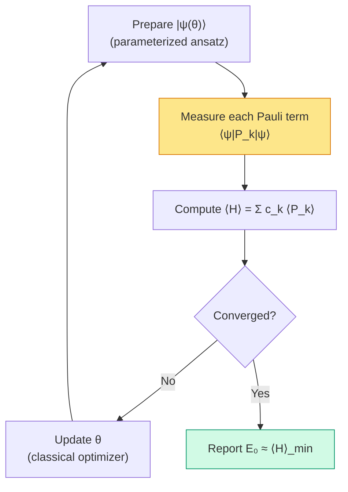

# Chapter 20: Algorithms — VQE and QPE

_The previous chapter produced a fixed-bond PySCF reference scan. Now we ask what a complete quantum energy-estimation workflow would require._

## In This Chapter

- **What you'll learn:** How the two major quantum chemistry algorithms — VQE (variational, near-term) and QPE (phase estimation, fault-tolerant) — consume the encoded Hamiltonian, and what measurement infrastructure they require.
- **Why this matters:** FockMap produces the *input* to these algorithms. Understanding what the algorithms need helps you make better encoding and tapering choices — and understand why the CNOT counts from Chapter 17 matter so much.
- **Prerequisites:** Chapters 17–19 (cost analysis, pipeline, bond angle scan).

---

## From Exact Diagonalisation to Quantum Hardware

Chapter 19 used PySCF RHF/FCI to produce a classical energy reference along one
angular coordinate at fixed O–H length. It did not run FockMap, taper a
14-qubit Hamiltonian, or prepare a quantum state. A quantum replacement would
need to reproduce the same electron/spin sector and energy at every geometry,
including state preparation, Hamiltonian measurement or controlled evolution,
and a complete error budget.

This is fine for validation. It is not fine for the molecules that actually matter. For N₂ (20 qubits → $2^{20} \approx 10^6$) or FeMo-co (108 qubits → $2^{108} \approx 10^{32}$), the matrix does not fit in any existing memory. The pipeline still produces the Pauli Hamiltonian $\hat{H} = \sum_k c_k P_k$ — but we need a different way to extract its ground-state energy.

Quantum algorithms take a different route. Instead of building the exponentially large matrix, a quantum computer prepares the state directly in $n$ qubits and extracts the energy through measurement. Everything we built — the encoding, the tapering, the Trotter decomposition, the circuit export — feeds directly into these algorithms.

There are two main approaches, and they make very different demands on the hardware.

**VQE** (Variational Quantum Eigensolver) uses short circuits and many measurements. It's designed for *near-term* quantum computers — noisy devices with limited circuit depth but reasonable qubit counts. The quantum computer prepares a trial state and measures Pauli expectation values; a classical computer optimises the state parameters.

**QPE** (Quantum Phase Estimation) uses deep circuits and few measurements. It's designed for *fault-tolerant* quantum computers — devices with error correction, where circuit depth is not the bottleneck. The quantum computer extracts the ground-state energy directly via phase kickback.

Both algorithms consume the same object: a Pauli Hamiltonian $\hat{H} = \sum_k c_k P_k$ — exactly what our pipeline produces.

---

## VQE: The Near-Term Algorithm

### The Loop

VQE is fundamentally an optimisation loop. The quantum computer serves as a function evaluator — it takes parameters $\boldsymbol{\theta}$ and returns an energy estimate $\langle\hat{H}\rangle_\theta$. The classical computer adjusts $\boldsymbol{\theta}$ to minimize the energy.



The yellow box is where FockMap's output matters most. Measuring $\langle P_k \rangle$ for each Pauli term in the Hamiltonian requires a separate circuit — or, better, measuring several commuting terms simultaneously.

### Measurement Grouping

Not every Pauli term needs its own circuit. Two Pauli operators can be measured simultaneously if they **qubit-wise commute** — that is, if they commute on every individual qubit position. For example, $ZI$ and $ZZ$ qubit-wise commute (both have $Z$ or $I$ at each position), so a single $Z$-basis measurement of all qubits yields both expectation values.

For a declared **qubit-wise-commuting** (QWC) strategy, every group must use one
compatible local basis on each qubit. Any grouping API must state whether it
uses QWC or the broader notion of general commutation (Yen, Verteletskyi &
Izmaylov, 2020).

The corrected 15-term H₂ Hamiltonian has a simple five-basis QWC partition: all
10 non-identity Z-only terms share the computational basis, while each of the
four full-support X/Y strings needs its own local basis. The identity needs no
shots and may be assigned to any group for bookkeeping.

The grouping matters because each distinct circuit must be run many times (to accumulate statistics), and each additional group multiplies the total measurement time. Fewer groups = faster VQE iterations.

### Shot Counts

Each measurement gives a binary outcome ($\pm 1$). To estimate the expectation value $\langle P_k \rangle$ to precision $\delta$, you need approximately $1/\delta^2$ repetitions ("shots"). But where does the total shot count formula come from? Let's derive it.

**The energy estimator.** The energy is $\langle\hat{H}\rangle = \sum_k c_k \langle P_k \rangle$. Each $\langle P_k \rangle$ is estimated from $N_k$ measurement shots, giving an estimator $\hat{m}_k$ with variance $\text{Var}(\hat{m}_k) \leq 1/N_k$ (since each shot yields $\pm 1$, the variance of a single outcome is at most 1).

**Error propagation.** The variance of the total energy estimate is:

$$\text{Var}(\hat{E}) = \sum_k c_k^2 \,\text{Var}(\hat{m}_k) \leq \sum_k \frac{c_k^2}{N_k}$$

**Optimal allocation.** If we have a total shot budget $N_\text{total} = \sum_k N_k$ and want to minimise $\text{Var}(\hat{E})$, Lagrange optimisation gives the optimal allocation $N_k \propto |c_k|$. Substituting back:

$$\text{Var}(\hat{E}) = \frac{1}{N_\text{total}} \left(\sum_k |c_k|\right)^2$$

**Setting the target.** For energy precision $\epsilon$ (meaning standard deviation $\leq \epsilon$), we need $\text{Var}(\hat{E}) \leq \epsilon^2$, giving:

$$N_\text{total} \geq \frac{1}{\epsilon^2}\left(\sum_k \lvert c_k\rvert\right)^2$$

This is the shot-count formula. The key quantity is the **1-norm** $\sum_k |c_k|$ — it determines the measurement cost because terms with larger coefficients contribute more variance and demand more shots. This estimate assumes each Pauli term is measured independently (or in qubit-wise commuting groups) and that the dominant error source is finite sampling. In practice, correlated measurement strategies (classical shadows, derandomisation) can improve the scaling, but the 1-norm estimate provides a useful and widely-cited baseline (Wecker et al., Phys. Rev. A 92, 042303, 2015).

The identity coefficient is known exactly and contributes no sampling variance,
so omit it from the measurement norm. Tapering can change the term list and
coefficients, but it does not guarantee that this 1-norm decreases; compute it
for the actual physical sector.

```fsharp
let epsilon = 0.0016
let measurementNorm = 1.8871072169
let independentTermBound =
    ceil (measurementNorm * measurementNorm / (epsilon * epsilon))
```

For the corrected, untapered H₂ Hamiltonian,
$\lambda_{\mathrm{meas}}=\sum_{k\ne I}|c_k|=1.8871072169$ Ha. The full
coefficient 1-norm is
$\lambda_{\mathrm{coeff}}=2.6992778241$ Ha when the known identity term is
included. The independent-term bound uses $\lambda_{\mathrm{meas}}$ and gives
about $1.39\times10^6$ shots at $\epsilon=1.6$ mHa. This is a worst-case
variance bound under the stated measurement model, not a prediction of the
shots required by every estimator. Neither quantity is the commutator sum
$\Lambda_{\mathrm{comm}}=0.2861997180$ Ha$^2$ from Chapter 15.

### Tracing a VQE Iteration for H₂

For H₂, a VQE iteration has the following structure:

1. **Prepare** a sector-appropriate trial state $\lvert\psi(\boldsymbol{\theta})\rangle$
2. **Measure** the Hamiltonian in the five QWC bases above, allocating shots according to the chosen estimator
3. **Compute** $\langle H \rangle = \sum_k c_k \langle P_k \rangle$ from the measurement results.
4. **Update** $\theta$ using a classical optimizer (e.g., COBYLA).
5. **Repeat** until $|\Delta E| < \epsilon$.

The number of optimizer iterations is ansatz-, optimizer-, noise-, and
initialization-dependent; there is no universal 20–50 iteration guarantee.
FockMap can provide the Hamiltonian and circuit primitives, while an execution
framework runs state preparation, sampling, and optimization.

### Where FockMap Fits

The confirmed FockMap contribution to VQE is before the measurement loop:

1. **The Hamiltonian** $\{c_k, P_k\}$ — the list of Pauli terms and coefficients
2. **Pauli-rotation circuits** — possible building blocks for state preparation
3. **Circuit export** — a bridge to the execution framework

Grouping and shot-allocation helpers are useful only after their exact
commutation model and variance assumptions are documented and tested.

The actual VQE loop — parameter optimisation, circuit execution, shot collection — is handled by execution frameworks like Qiskit, Cirq, or Quokka. FockMap produces the input they consume.

---

## QPE: The Fault-Tolerant Algorithm

### The Idea

QPE does not optimize a variational objective. Given controlled time evolution
and an input state with overlap on an eigenstate, phase kickback estimates that
eigenstate's energy. It returns the ground-state energy only to the extent that
the prepared state overlaps the ground state and the resulting phase is selected
(Kitaev, 1995; Reiher et al., 2017).

One way to implement the required controlled evolution is a product formula
using the Pauli rotations from Chapter 15. Qubitization and other Hamiltonian-
simulation methods are alternatives; QPE requires controlled evolution, not
Trotterization specifically.

### The Circuit

Choose a reference shift $E_{\mathrm{shift}}$, an evolution time $t_0$, and
a known energy interval narrow enough that its width $W$ satisfies
$Wt_0<2\pi$. Define

$$U=e^{-i(\hat H-E_{\mathrm{shift}})t_0}.$$

For an eigenstate $\lvert E\rangle$,

$$U|E\rangle=e^{2\pi i\phi}|E\rangle,\qquad
\phi=-\frac{(E-E_{\mathrm{shift}})t_0}{2\pi}\pmod 1.$$

The QPE circuit has an ancilla register and a system register holding a trial
state $\lvert\psi\rangle=\sum_E a_E\lvert E\rangle$:

1. Ancilla qubit $j$ controls an approximation to $U^{2^j}$.
2. After all controlled operations, an inverse QFT on the ancilla register converts the accumulated phases into a binary representation of the energy eigenvalue.
3. Measuring the ancilla register yields an $m$-bit phase estimate associated
   with eigenvalue $E$ with probability approximately $\lvert a_E\rvert^2$, before
   finite-precision and simulation errors.

A naive implementation repeats a base circuit $2^j$ times for $U^{2^j}$;
more advanced simulation methods organize the long-time evolution differently.
Either way, the largest controlled evolution drives the precision cost.

The cost is dominated by controlled Hamiltonian simulation at exponentially
increasing times. A controlled Pauli rotation is not obtained by universally
"doubling the CNOT count"; the overhead depends on the decomposition, controls,
ancilla strategy, target gate set, and error budget.

### Resource Estimation

For target energy resolution $\epsilon$, ignoring confidence overhead:

- **System qubits**: $n$ (from the encoding, after tapering)
- **Resolution qubits**:
  $m\ge\left\lceil\log_2\!\left(2\pi/(\epsilon t_0)\right)\right\rceil$
- **Additional repetitions or ancillas**: enough to reach the stated confidence
- **Controlled-simulation accuracy**: budgeted so phase-estimation error,
  Hamiltonian-simulation error, and state-preparation error meet the final
  energy target

For H₂ with $t_0=1$ atomic unit and $\epsilon=1.6$ mHa, the formula gives
12 resolution qubits, not 10, before confidence overhead. This arithmetic is
meaningful only after specifying an energy shift and range that prevent
aliasing. The book does not quote a total controlled-gate count for H₂ or H₂O
until a complete, reproducible simulation and confidence model is provided.

---

## VQE vs QPE: A Summary

| | VQE | QPE |
|:---|:---|:---|
| **Hardware** | Near-term (noisy) | Fault-tolerant |
| **Circuit depth** | Ansatz-dependent | Deep controlled evolution |
| **Measurements** | Many (estimator-dependent) | Repeated phase samples for confidence and state-overlap filtering |
| **Classical cost** | Optimisation loop | QFT + readout |
| **Bottleneck** | Shot count, barren plateaus | Circuit depth, error correction |
| **FockMap provides** | Hamiltonian + measurement groups | Hamiltonian + Trotter circuits |

Chapter 19 uses PySCF FCI to supply a classical reference energy at each point
of a fixed-bond angular scan. Replacing that backend with VQE or QPE would
require a sector-appropriate state-preparation and error budget at every
geometry; it is not a drop-in substitution of one function call.

---

## The Measurement Program in Practice

Let's look at the QWC measurement infrastructure for the corrected direct H₂
Hamiltonian in detail.

A valid QWC grouping for the corrected H₂ Hamiltonian is:

| Group | Terms | Measurement basis |
|:---:|:---:|:---|
| 1 | 10 non-identity Z terms (+ optional identity) | ZZZZ (computational basis) |
| 2 | 1 | XXYY |
| 3 | 1 | XYYX |
| 4 | 1 | YXXY |
| 5 | 1 | YYXX |

Group 1 contains all Z-only terms. Each full-support X/Y string requires its own
local basis under QWC grouping. A general-commuting strategy may combine terms
differently but needs an entangling measurement circuit and must be labelled as
such.

This is the bridge between FockMap's algebraic output and the experimental reality of a quantum computer: each group becomes a circuit variant, each circuit runs thousands of times, and the statistics are combined to estimate the energy.

---

## What FockMap Does — and What It Doesn't

FockMap's scope ends at circuit generation. It is important to be clear about what lies *outside* that scope:

- **Ansatz design**: VQE requires a parameterized circuit (ansatz). FockMap does not design ansätze — it provides Trotter circuits and Pauli operator pools that downstream tools (Qiskit, tket, PennyLane) can use as building blocks.
- **Classical optimisation**: the VQE optimisation loop (choosing $\boldsymbol{\theta}$, handling barren plateaus, selecting an optimizer like L-BFGS or COBYLA) is handled by the execution framework, not FockMap.
- **Hardware execution**: submitting circuits to real devices, managing job queues, handling device calibration — all downstream.
- **Error mitigation**: ZNE, PEC, symmetry verification — these operate on measurement outcomes and are handled by execution frameworks. (FockMap's tapering symmetries are useful *inputs* to symmetry verification, but FockMap doesn't implement the mitigation itself.)
- **Noise modelling**: hardware noise interacts with both Trotter error and measurement error. FockMap's cost estimates are for *ideal* (noiseless) circuits; real performance depends on device characteristics.

> **Barren plateaus**, briefly: as the number of qubits grows, randomly initialized VQE ansätze tend to produce cost function landscapes where the gradient vanishes exponentially — a phenomenon called a barren plateau. This is a fundamental challenge for VQE at scale, and it is one reason why adaptive methods (ADAPT-VQE) and physically motivated ansätze (e.g., UCCSD) are preferred over hardware-efficient random circuits.

---

## Key Takeaways

- **VQE** uses FockMap's Hamiltonian for measurement-based energy estimation. Fewer Pauli terms and lower 1-norm (from tapering) directly reduce the shot count.
- **QPE** uses FockMap's Trotter circuits for phase estimation. Lower CNOT counts (from encoding choice) directly reduce the circuit depth.
- **Measurement grouping** reduces the number of distinct circuits by combining qubit-wise commuting terms. FockMap does this automatically.
- Both algorithms consume the same input — the Pauli Hamiltonian — but make different demands on the hardware. Encoding and tapering choices help both.

## Further Reading

- Peruzzo, A., McClean, J., Shadbolt, P., Yung, M.-H., Zhou, X.-Q., Love, P. J., Aspuru-Guzik, A., and O'Brien, J. L. "A variational eigenvalue solver on a photonic quantum processor." *Nat. Commun.* 5, 4213 (2014). The original VQE paper.
- Kitaev, A. Yu. "Quantum measurements and the Abelian Stabilizer Problem." arXiv:quant-ph/9511026 (1995). Introduces quantum phase estimation, the foundation of QPE-based chemistry algorithms.

---

**Previous:** [Chapter 19 — A Fixed-Bond Water Angle Scan](19-bond-angle.html)

**Next:** [Chapter 21 — Speaking the Hardware's Language](21-circuit-export.html)
