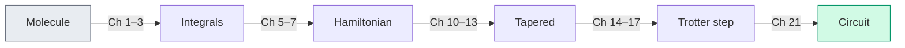

# Chapter 23: What Comes Next

_The translation layer is assembled. The book is almost over. The algorithms and hardware story is not._

## In This Chapter

- **What you'll learn:** What lies beyond this book — the extensions, open problems, and emerging directions that build on the foundation we've laid.
- **Why this matters:** A pipeline is only as useful as the questions it can answer. This chapter maps out where those questions lead.
- **Prerequisites:** The whole book (but especially Chapters 18–22).

---

## What We Built

Let's take a final inventory. Over twenty-three chapters, we constructed the
translation and circuit-compilation layer:

Every arrow is a function call in FockMap. Every box has been tested on H₂ and applied to H₂O. The pipeline is real, open-source, and published on NuGet.

But a pipeline is an instrument, not a destination. Here's where the instrument gets used.

---

## Near-Term Extensions

### Circuit Optimisation

FockMap currently produces *unoptimised* gate sequences — each Pauli rotation becomes a CNOT staircase exactly as described in Chapter 16. Real quantum compilers (Qiskit's transpiler, Quantinuum's TKET/pytket, BQSKit) apply additional transformations:

- **Gate cancellation**: adjacent CNOT pairs cancel. Identity-equivalent sequences are removed.
- **Commutation-based reordering**: Pauli rotations that commute can be reordered to bring cancellable gates adjacent.
- **Template matching**: known circuit identities replace expensive subcircuits with cheaper equivalents.
- **Hardware-aware routing**: map logical qubits to physical qubits, inserting SWAP gates as needed for limited connectivity.

These optimisations typically reduce CNOT count by 20–40% beyond what FockMap produces. They operate on the gate-level output (QASM, Q#, or JSON) and don't require changes to the Hamiltonian construction.

### Error Mitigation

Near-term quantum computers are noisy. Error mitigation techniques extract better estimates from noisy circuits without the overhead of full error correction:

- **Zero-noise extrapolation (ZNE)**: run the circuit at several artificial noise levels, then extrapolate to the zero-noise limit.
- **Probabilistic error cancellation (PEC)**: represent the ideal circuit as a linear combination of noisy circuits and sample the combination.
- **Symmetry verification**: post-select on measurement outcomes that satisfy known symmetries of the Hamiltonian (our tapering symmetries from Chapter 11 are ideal for this).

FockMap's contribution is the symmetry information: the Z₂ generators, Clifford rotations, and parity sectors from the tapering analysis provide exactly the symmetry constraints that verification-based mitigation needs.

### Adaptive Ansätze

VQE (Chapter 20) uses a fixed ansatz — a predetermined circuit structure with adjustable parameters. Adaptive methods grow the ansatz one operator at a time:

- **ADAPT-VQE**: at each iteration, select the Pauli operator from the Hamiltonian pool that gives the steepest energy gradient, add it to the ansatz, and re-optimise.
- **Qubit-ADAPT**: same idea, but using single-qubit and two-qubit operators instead of full Pauli strings.

FockMap's Pauli-level representation of the Hamiltonian provides the operator pool that ADAPT-VQE selects from. The encoding choice affects the pool — lighter Pauli strings make better ADAPT operators, which is another argument for ternary tree encoding at scale.

---

## Bosonic Simulation

FockMap already supports bosonic ladder operators and three bosonic-to-qubit encodings (unary, binary, Gray code — see the API documentation). The natural extension is **vibronic simulation**: mixed electron-phonon systems where both fermions and bosons are present.

Applications include:
- **Molecular vibrations**: the bond angle scan in Chapter 19 gives the equilibrium geometry; the *curvature* of the PES gives vibrational frequencies. Concretely, a finite-difference Hessian — computed by running the same pipeline at slightly displaced geometries — yields the force-constant matrix. Diagonalizing it (mass-weighted) produces the normal modes and harmonic frequencies, which connect directly to infrared and Raman spectroscopy. The entire calculation uses no machinery beyond what this book has already built: repeat the pipeline at a few geometries, take numerical derivatives, and diagonalize a small matrix. This is real computational chemistry — the same workflow that production codes use to predict molecular spectra.
- **Polaron physics**: electron-phonon coupling in materials science, where an electron "dressed" by lattice distortions has different effective mass and mobility.
- **Photochemistry**: conical intersections and non-adiabatic dynamics, where nuclear and electronic motion couple strongly.

The encoding pipeline for bosonic modes parallels the fermionic one: ladder operators → Pauli strings → Hamiltonian assembly. The main difference is that bosonic modes require a truncation parameter $d$ (the maximum occupation number per mode), and the encoding choice affects how many qubits each mode costs.

---

## Lattice Models

The second-quantised framework isn't limited to molecules. Lattice models in condensed matter physics use the same operator algebra:

- **Hubbard model**: electrons hopping on a lattice with on-site repulsion. The same ladder operators, the same encodings, the same tapering — different integrals.
- **Heisenberg model**: spin-spin interactions on a lattice. Already expressed in Pauli operators — no encoding step needed.
- **Fermi-Hubbard at half-filling**: a testing ground for quantum advantage, where classical methods (DMRG, QMC) have known limitations in 2D.

FockMap's encoding and tapering infrastructure applies directly to these systems. The Hamiltonian assembly step simplifies (lattice models have regular structure), but the downstream pipeline — Trotter decomposition, cost analysis, circuit export — is identical.

---

## The Deepest Connection

We'll end with the most surprising insight of all.

The tapering machinery from Chapters 10–13 is, at its core, stabiliser theory: finding commuting Pauli operators that generate a symmetry group, and using Clifford rotations to diagonalise them. This is precisely the mathematical framework of quantum error-correcting codes.

- **Stabiliser codes** (surface code, Steane code, etc.) encode logical qubits into physical qubits using a stabiliser group — a set of commuting Pauli operators whose simultaneous eigenspace defines the code space.
- **Syndrome measurement** detects errors by measuring the stabilisers, exactly as our tapering step measures the Z₂ generators.
- **Logical operators** act within the code space, just as our tapered Hamiltonian acts within the symmetry sector.

The algebra is the same. The difference is intent: tapering exploits physical symmetries to reduce qubit count, while error correction engineers artificial symmetries to detect and correct errors. A reader who has understood Chapters 10–13 has already learned the algebraic foundation — the stabiliser formalism — that quantum error correction builds upon.

This book didn't just teach you how to simulate molecules. It taught you the mathematics of quantum error correction — without ever calling it that. The same Clifford gates, the same symplectic representation, the same sector-selection algebra. When you encounter the surface code or the Steane code in the QEC literature, you will recognise every move.

---

## Open Problems

Some questions this book doesn't answer — because nobody has yet:

1. **Optimal encoding**: is there a provably optimal encoding for a given Hamiltonian? Binary and ternary tree constructions both have $\Theta(\log n)$ worst-case weight, with different constants and finite-size bounds. The best encoding may depend on the Hamiltonian's sparsity, symmetry, orbital ordering, and hardware connectivity rather than on $n$ alone.

2. **Tapering beyond Z₂**: our tapering removes symmetries that square to the identity (Z₂ symmetries). What about higher-order symmetries — U(1) particle number conservation, SU(2) spin symmetry? These could remove more qubits, but the Clifford rotation synthesis is harder.

3. **Trotter error bounds**: how many Trotter steps do you actually need? Tight error bounds for product formulas are an active area of research. Tighter bounds mean shorter circuits, which means earlier quantum advantage.

4. **Classical simulation limits**: where exactly does classical simulation become infeasible? DMRG and tensor network methods keep improving. The crossover point — where quantum simulation beats the best classical method — shifts with every algorithmic advance on both sides.

---

## What the Pipeline Provides

We'll end where we began. Chapter 1 asked: *given a molecule, what is its ground-state energy?* The machinery in this book addresses the translation layer: molecular integrals become encoded Pauli Hamiltonians, symmetry reductions, product-formula circuits, and portable circuit descriptions. That toolchain does not by itself prepare a molecular ground state or guarantee an efficient energy estimate; those tasks still require a validated VQE, QPE, or other state-preparation and measurement workflow.

Small systems such as H₂ let us validate each translation against direct matrices and classical reference energies. Larger systems expose the real costs: state overlap, circuit depth, measurement, error correction, and comparison with improving classical methods.

The H₂ reference data in Chapter 18 test the construction at a scale where every matrix element can be checked. The water calculation in Chapter 19 is a PySCF angular scan at fixed O–H length; it shows how geometry changes the electronic problem without pretending that circuit construction alone solved the molecular structure. With validated algorithms and sufficient hardware, the same translation machinery could support studies of catalysts, photoactive molecules, and strongly correlated reaction mechanisms.

The translation layer is necessary. It is not the whole computation.

---

## Key Takeaways

- **Circuit optimisation**, **error mitigation**, and **adaptive ansätze** build directly on FockMap's output.
- **Bosonic simulation** extends the same pipeline to electron-phonon systems, vibrations, and photochemistry.
- **Lattice models** use the same operator algebra and encoding infrastructure.
- **Quantum error correction** uses the same stabiliser theory as tapering — different intent, same mathematics.
- Scaling requires more than adding qubits: state preparation, algorithms, software validation, and hardware all remain bottlenecks.

## Further Reading

- Gottesman, D. "Stabilizer Codes and Quantum Error Correction." PhD thesis, California Institute of Technology (1997). The stabiliser formalism that underpins both tapering and quantum error correction.
- Campbell, E. T. "Early fault-tolerant simulations of the Hubbard model." *Quantum Sci. Technol.* 7, 015007 (2022). Explores the bridge between NISQ-era techniques and early fault-tolerant quantum simulation.

---

**Previous:** [Chapter 22 — Scaling — From H₂ to FeMo-co](22-scaling.html)

**Back to:** [Table of Contents](foreword.html)
